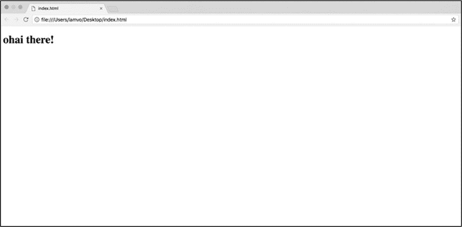
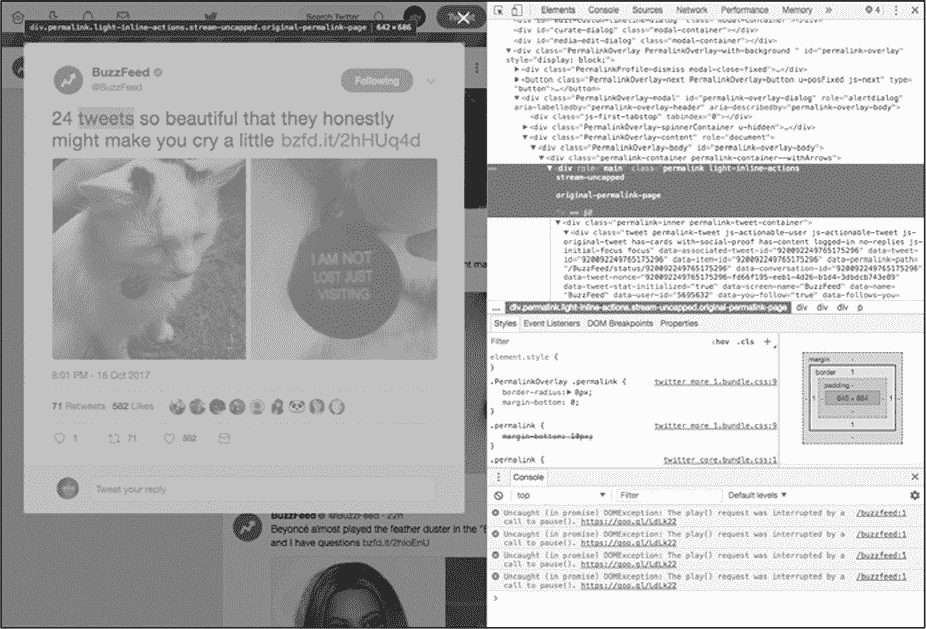
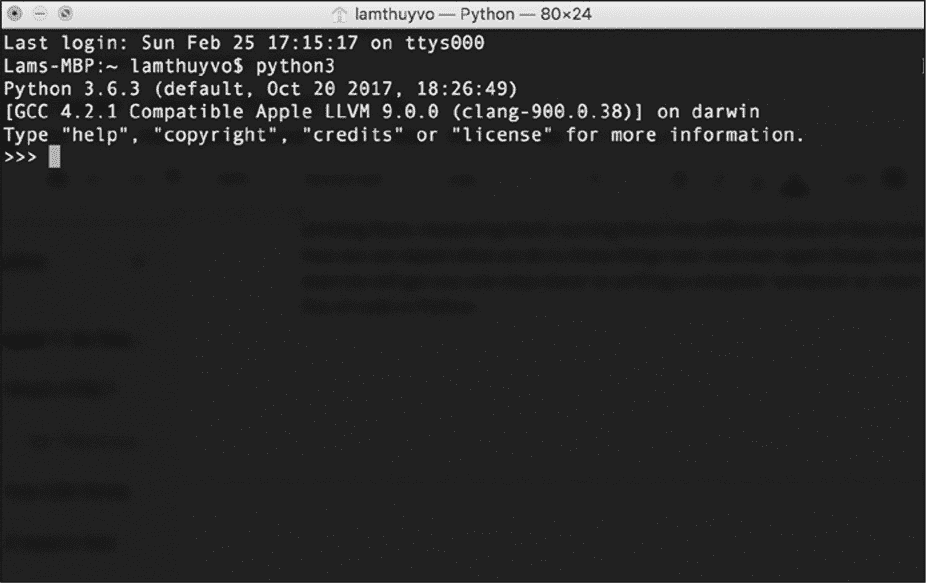

# 1 应了解的编程语言
--------------------------------------------------------------------------------------------------------

无论我们讨论的是Facebook上的帖子、Tweet还是Yelp上的评论，都需要了解在线平台的结构，以便从中提取信息。为此需要学习编码和web开发的基础知识。

本章向读者概述了web是如何在web语言和数据挖掘工作环境中运行的。了解数据库和web页面如何交互？会帮助我们调查哪些类型的社交媒体数据是在线可用的，以及我们如何获取这些数据。

那么应该从哪里开始呢?对于初学者来说，编写代码的过程可能会有些令人生畏(对我来说绝对是这样！)这是一个充斥着缩略语、技术术语和多种编程语言的世界。浏览所有这些语言可能会让人不知所措，所以首先缩小范围，看看它们扮演的角色。

#### 前端语言

 Web语言大致可以分为两类:前端语言和后端语言。在本章开始，我们将讨论web浏览器用于阅读、解释和呈现我们在浏览器窗口和网站选项卡上看到的视觉元素的三种前端语言:HTML、CSS和JavaScript。这些语言对我们来说很重要，因为它们包含了我们想从社交媒体网站上挖掘的内容。

###### HTML是如何工作的？

我们想要收集的许多社交媒体内容都存在于网站上，而网站是由超文本标记语言(Hyper
Text Markup
Language，HTML)组成的。HTML将构成网站内容的文本和图像结构化，以便浏览器能够呈现或显示用户要查看的内容。HTML代码本身只是一个文本文件，但是当在浏览器中打开HTML文件时，它告诉浏览器把内容格式化并显示为web页面。

Web页面由以html扩展名结尾的文件组成。大多数网站的首页都是index.html，所以当访问一个网站时index.html是浏览器通常寻找的文件。这些文件通常存储在服务器上，服务器就像计算机上的硬盘驱动器，总是处于打开状态，其他计算机可以通过internet访问它。统一资源定位器URL有点像服务器上文件夹的地址。

 当浏览器访问一个URL时，会下载几行代码，然后以可视的形式进行解释和呈现。一个简单的网站可能只包含一行代码，如图1-1所示。

*图1-1:一个非常基础的网站*

该网站的代码如下：

上述代码示例显示的内容是"ohai there!"，围绕内容的两段文本称为HTML标记。

标记是文本和尖括号(\<\>)的组合，告诉浏览器应该如何组织每种类型的内容。例如，代码示例中的\<p\>和\</p\>标记告诉浏览器该句子是一个段落。HTML标记还可以告诉浏览器标记中的内容是标题、图像还是其他类型。标记和标记中的内容一起称为元素。每个元素通常以开始标记（例如\<p\>）开始，并以结束标记（与开始标记相同）但在第一个尖括号之后以反斜杠（例如\</p\>）结束。开始和结束标记之间包含将在网页上呈现的内容。有些元素（例如\）被称为空元素(void
elements)，不需要结束标记。

 图1-2标记了一个基本的HTML段落元素。

*图1-2：HTML段落元素*

 当在浏览器中呈现图1-2中的元素时，会显示图1-3的样子。

*图1-3：图1-2中的段落元素在浏览器中打开时的样子*

总的说来，HTML标记是告诉浏览器如何构造内容的一种方式，而标记之间的信息告诉浏览器应该在网页上呈现什么内容。

HTML元素也可以嵌套，这意味着一个标记包含一个或多个其他标记及其内容。此功能通常用于对相关元素进行集群。例如，标题和段落可以嵌套在定义了划分的\<div\>标记中。嵌套元素表示\<div\>标记中的标题和段落属于同一类。为了显示嵌套，通常使用缩进------也就是说，在一行代码前面添加空格或制表符---这是可选的，但是可以使代码更清晰。

例如，可以将图1-1中的段落元素放入\<div\>标记中，如下所示：

 现在，整个段落元素都包含在开始和结束\<div\>标记内。为了显示段落元素是嵌套的，我们还将其放置在与\<div\>标记分开的一行上，并将该行缩进了四个空格。在浏览器中呈现时，嵌套的段落元素应类似于图1-4。

*图1-4:在浏览器中呈现的div和嵌套段落元素*

HTML语言在运行时是忽略缩进的，而\<div\>标记在呈现时是不可见的。这意味着浏览器只呈现段落标记内的内容，因而呈现的外观与图1-3所示相同。

虽然在浏览器中不能实际看到\<div\>标记和其他不可见的HTML结构，但它们很有用，因为它们把网页组织成块。例如组成一条推文的许多部分，每条推文都包含发布者的Twitter信息(用户名、Twitter句柄和Twitter个人资料照片)、时间戳、推文文本、推文的转发次数和收藏的数量。这些部分都聚集在嵌套的HTML标记中。嵌套可能会变得相当复杂，这取决于网站的复杂程度以及有多少元素彼此相关。一些嵌套的元素甚至可以进一步嵌套在其他元素中！

当从网站中挖掘信息时，了解HTML元素中的内容是如何构成的，以及想要查找的特定信息位于何处，将会有所帮助。稍后将重新讨论如何检索嵌套元素来检查推文的HTML结构。首先，需要讨论与HTML紧密相关的CSS。

###### CSS是如何工作的？

到目前为止，所有的例子都是纯文本，但是网站通常由更多的内容组成。例如，推文的文本可能是与显示推文发布日期和时间的文本不同的字体、颜色和大小。您可能想知道浏览器如何知道如何呈现不同颜色、字体和大小的HTML元素？这就是层叠样式表(Cascading
Style Sheets，CSS)发挥作用的地方。

CSS是如何给予HTML颜色、功能和(有些人甚至说)字符？CSS是一种允许我们为不同类型的HTML内容分配特定外观的语言。读者可以将CSS视为一组视觉指导方针，CSS告诉浏览器每个HTML元素在web页面上的外观需要如何呈现。

 例如，只有通过CSS页面才会从图1-4变成图1-5。

*图1-5:在浏览器中使用CSS格式呈现的div和段落元素*

在社交媒体数据领域，CSS通常用于确保以一致的方式呈现元素类型。例如，在推文的时间轴上，每个推文的时间戳都需要以相同的字体、颜色和大小呈现。

有多种方法可以为HTML标记分配CSS样式。一种方法是通过内联CSS，它在创建HTML标记的同一行中分配CSS。您可以在清单1-1中看到一个这样的例子。

*清单1-1:使用内联CSS格式化HTML*

在本例中，属性被添加到\<div\>的标记中。属性是与每个HTML标记相关联的附加信息。属性名位于开始的尖括号\<和标记名(在本例中为\<div\>)之后，在结束的尖括号\>之前。名称后面跟一个等号(=)，然后是属性的内容，它包含在双引号之间(尽管HTML也接受单引号)。属性通常是属于它们所在的标记的特征。

属性被传递给嵌套的HTML元素。在这种情况下，\<div\>标记的样式属性➊我们添加内联CSS,这意味着现在任何内容在\<div\>标记内时必须遵循CSS样式规则中定义样式属性。由于段落元素嵌套在\<div\>标记中，因此段落元素及其内容继承分配给\<div\>的任何样式。

CSS使用属性来改变颜色、字体和其他我们可以在网站上使用的格式选项。属性类似于HTML属性，但是用冒号(:)将属性名与属性值分隔开。例如,在➋样式属性的颜色属性,这决定了我们的字体的颜色（相关教程，请参见https://www.w3schools.com/colors/）。网站使用十六进制颜色，它表示由六个数字和字母组成的颜色。在本例中，\#272727表示深灰色。

向HTML添加CSS的另一种方法是在内部样式表中编写样式规则。样式表是内部的，因为CSS是直接插入到样式标记之间的HTML代码中，\<style\>\</style\>，但是它的格式与标记不内联。

使用内部样式表查看网站时，读者会在这些\<style\>标记内找到类和ID。类是在\<style\>标记中定义的样式规则，可以应用于多个HTML元素。通过使用类，您可以定义一次样式规则，并将其分别应用于每个元素。每个HTML元素可以具有多个类。ID类似于类，您可以在\<style\>标记中定义样式规则，但是ID不能用于多个HTML元素。

清单1-2显示了一个内部样式表的示例，它定义了如何对类和ID进行样式化。

*清单1-2：使用内部样式表将CSS样式分配给HTML*

每个样式规则位于\<style\>标记之间。第一组样式规则位于类内部，该类以英文句点（.）➊和类名称开头。在本例中该类名为my_styles（请注意！名称中没有空格）。类名后跟两个花括号（{}），其中包含该类的样式规则。读者可以看到清单1-2的CSS为my_styles类所应用的任何元素指定了颜色，字体大小，字体粗细和文本阴影。示例中显示的下一条规则创建一个ID，其名称为my_div。ID用井号（\#）标记，后跟ID名称。花括号之间也包了该含ID的样式规则。内部样式表以\</style\>标记结束。

尽管CSS样式规则是在这个HTML中定义的，但这并不意味着它们适用于任何HTML元素。为了格式化HTML元素，需要将类或ID分配给标记。

要做到这一点,我们分配"my_styles"类和"my_div"ID \< div
\>标记的➌类和ID属性。这意味着div元素中的任何内容现在都根据my_styles类和my_div
ID规则进行样式化。

 图1-6显示了这个CSS和HTML创建的外观。

*图1-6:应用于清单1-2中的嵌套div元素的内联CSS样式表*

通常情况下，开发人员在设计网站时需要编写数百(如果不是数千)行CSS代码。当样式规则变得复杂和丰富时，开发人员通常会将它们放入一个称为样式表的单独文档中，并通过外部链接标记(如下所示)加载到HTML页面中：

CSS样式表使用.css后缀名保存并存储在服务器上。外部样式表的格式与内部样式表相同，只是您不需要HTML的\<style\>标记，因为外部样式表不是HTML文件。

以上是关于使一个网站看起来很漂亮的信息。这些现在看起来可能与我们的目的无关，但是CSS很重要，**因为它帮助我们理解web设计师如何在网站上构建重复的元素**。例如，如果设计人员使用一个类来以特定的方式设计Facebook帖子的所有标题，那么查找包含标题的每个HTML元素就会容易得多。

既然您已经了解了网站设计和结构的基础知识，让我们来看一个来自Twitter的示例，它展示了HTML和CSS的实际应用。

######## 如何在HTML和CSS中构造推文

 让我们从Twitter时间轴上的一条推文开始，如图1-7所示。

*图1-7：显示在Twitter时间轴上的tweet示例*

时间轴上的每一项都代表一条推文，每条推文都有一个附加的信息子集。而且，正如您现在可能已经收集到的，每个推文都是使用HTML和CSS组织和呈现的。

当浏览器为用户呈现简洁的视觉效果时，这个网站比我们最初想象的要复杂得多。让我们来看看作为代码行的推文是什么样子的。为此我们需要打开一个漂亮的小浏览器特性，称为开发工具（developer
tools）。这些工具内置在一些浏览器中（如Chrome），也可以作为其他浏览器(如Firefox)的插件使用。我们会用Chrome浏览本书的例子，读者可以从*[https://www.google.com/chrome/]{.ul}*下载。

使用谷歌Chrome，进入一个Twitter时间轴，点击一条推文。在Chrome中访问推文的HTML，可以从Chrome菜单中选择"右上角竖直的**...**
▸ 更多工具 ▸
开发工具"，或者在Windows中按CTRL-SHIFT-I或COMMAND-OPTION-I在Mac上。

这将在浏览器中打开第二个视图，称为Web Inspector。Web
Inspector允许您查看网站下面的代码，如图1-8所示。

将鼠标逐行移到代码上。当你这样做的时候，Chrome应该高亮显示网页中与你的代码相对应的部分。您可以通过单击HTML标记左侧的小三角形来展开或折叠嵌套的HTML。最初的几个标记可能会突出显示整个网站，但对于我们的目的，我们只想看到组成一条推文的代码。当你自己这么做的时候，你需要深入到每个嵌套的标记，直到Chrome只突出显示你要找的网站部分。对于大型复杂的网站，这个过程可能需要一段时间。

*图1-8：在Web检查器中打开一条推文* 

对于本例，我们将直接跳到要查找的内容。单击Web
Inspector内部(不是在Web页面上!)，在Windows上按CTRL-F，在Mac上按COMMAND-F。Inspector窗口中应该出现一个搜索栏。在搜索栏中输入permalink-container，然后回车。应该将您带到一个只突出显示单个推文的div类。

现在您可以看到该推文由嵌套在\<div\>标记中的一堆代码组成，该标记已被分配为类permalink-
container。请注意，该代码是由标记和类组成的，例如到目前为止，我们已经介绍了简单的HTML示例。尽管实际的网站数据看起来很复杂，但是信息却像嵌入在更简单的HTML代码中一样被嵌入到标记中。

让我们更仔细地看看推文的代码。其中有很多信息，但是不要担心！我们把它分解一下，一次看一部分。清单1-3显示了图1-8中推文的压缩版本(因为每个推文可能有600多行代码)。

在Twitter上，每条推文都生活在这样的结构中，在本书的最后您将能够使用代码从成百上千个这样的结构中自动提取您需要的信息。这个例子中的HTML乍一看很复杂，但是您可以通过逐个查看来理解它。

例如,\<div\>标记的类permalink-container包围整个推文➊HTML标记。嵌套在该标记中的是带有类的推文➋的\<div\>以及与该推文相关但未显示的一些信息。其中一些信息用一个容易理解的名字标记，如data-following-you，它告诉浏览器该tweet的所有者是否在跟踪您的Twitter帐户。其他信息（例如data-permalink-path➌）具有不透明的名称，您需要通过一些侦探工作来弄清楚该名称。在这种情况下，data-permalink-path是在推文的https://twitter.com/URL末尾的链接。该代码段的末尾是一个\<
strong\>标记,
该标记使文本变为粗体，并为其指定了类fullname➍。\<strong\>标记的内容是Twitter账户名BuzzFeed。

虽然这些代码最初看起来让人不知所以然，但通过仔细梳理，我们发现了与这条推文相关的重要信息。我们将从社交媒体上挖掘的许多数据也是如此。

*清单1-3:组成单个推文的HTML*

###### JavaScript（Java脚本）是如何工作的？

HTML和CSS与我们的数据收集直接相关，因为它们与我们感兴趣的社交媒体内容密切相关，但是在一个网站中还有一些不断变动的部分，比如JavaScript。

JavaScript是一种编程语言，为网站带来了交互性，可以操纵页面上呈现的元素。JavaScript可以在呈现网页之前或之后动态更改网页。换句话说，使用JavaScript我们可以改变HTML和CSS的属性，甚至在页面上创建新的HTML元素。

接下来看看如何使用JavaScript更改清单1-4中的段落的颜色。

*清单1-4:嵌套在div中的段落*

 这段代码会在浏览器中呈现图1-9所示的样子。

*图1-9:应用了一些样式的段落*

清单1-4中的代码包含一个\<div\>标记，该标记被分配了一个名为my_styles的类和一个名为my_box的ID。使用JavaScript，我们可以利用\<div\>标记中的类或ID选择段落的HTML标记。有了标记的类或ID后，我们就可以使用JavaScript为标记分配新的类或新的样式。

在清单1-4的代码中添加一些JavaScript，它使用ID="my_box"选择HTML元素，如清单1-
5所示。

*清单1-5:使用JavaScript根据ID选择元素并修改其颜色*

JavaScript必须位于\<script\>标记之间，该标记告诉浏览器该标记的内容是用HTML以外的其他语言编写的代码。浏览器需要知道我们使用的是哪种语言，因此我们将\<style\>标记的type属性分配给text
/ javascript➋。

虽然您可能不知道如何阅读JavaScript，但是您通常可以通过阅读它来理解一些内容。让我们尝试一次一次浏览JavaScript。首先我们浏览文档，然后我们使用JavaScript的名为getElementById（）的部分，该部分会告诉您确切的功能（它根据其ID获取元素）。在许多编程语言中，当代码带有括号时，括号外的部分将作用于括号内的内容。在这种情况下，my_box位于括号内，因此我们告诉getElementById（）对my_box起作用。这将在➊处获取具有my_box
ID的div元素。然后，为div分配一个新的CSS样式和颜色。在这种情况下会应用样式"红色"。

 通过这段JavaScript代码，我们现在已经更改了在浏览器中呈现的文本的颜色，使其看起来如图1-10所示，其中深灰色表示红色文本颜色。

*图1-10:使用JavaScript应用于div的样式*

这是JavaScript工作的基本方式。你不需要知道如何写JavaScript的这本书，但你应该明白：这是一个非常重要的组成部分的网页，它有能力改变一个网站的内容，包括我们准备从社会媒体网站收集的内容。

#### 后端语言

正如读者所看到的，当检查社交媒体网站的代码时，很多感兴趣的数据都是红容易找到的，但是还有其他方法可以获得普通用户看不到的数据。这些方法是为程序员开发的，因此为了访问这些数据，读者也需要成为一名程序员，因此需要学习一种后端语言。

后端语言可以创建、更新以及与存储在服务器上的数据库通信。读者可以想象：有一个通过互联网访问的服务器硬盘，这个硬盘是一个很大的物理驱动器，里面包含很多信息，包括：社交媒体数据和所有的HTML和CSS文件，这些文件构成了可以查看在线的网站。后端语言还允许在计算机上创建文本文件或电子表格等文件，也可以把数据直接写入这些文件中。

###### 使用Python

在本书中，使用Python作为后端语言来收集和分析数据。Python是一种开源编程语言，由是由一个社区开发且提供给开发人员免费使用，但也可以用于商业的目的。

本书的目的不是让读者成为Python方面的专家，而是帮助读者理解：基本的编码概念、Python语言如何工作、如何阅读和理解现有的脚本(包含代码的文本文件)，以及如何根据自己的需要修改代码。换句话说，在阅读了这本书之后，读者将不会构建奇特的应用程序，也不会用Python编写复杂的脚本，但是会了解足够多的"危险"，同时可以为自己的目的构建脚本。

无论读者的电脑上是否已经安装了Python，都应该通过Python的官方网站(*[https://www.python.org/downloads/]{.ul}*)下载并安装最新版本的Python（3.7）。

###### Python简介

为了通过使用Python从而达到我们的目的，我们需要理解基本的编码概念，所以接下来的几个练习将向您介绍其中的几个。将每个练习看作是一节词汇或语法课，会让读者离编写完整的"句子"更近一步------在本例中是功能性的Python代码行。

对于这些练习，读者需要在交互式shell中输入几行代码，交互式shell是一个可以阅读和理解Python的接口。首先，读者需要打开命令行接口(command
line
interface，CLI)，这是计算机上允许您运行命令的程序。在mac电脑上使用终端Terminal，可以从Applications文件夹中找到。在Windows上可以使用命令提示符，可以通过"开始"菜单使用命令提示符。

打开命令行接口并在Mac或Windows上输入python3，就可以打开交互式shell。如果看到看起来像三个尖括号(\>\>\>)的提示符，那么说明交互式shell已经打开，如图1-11所示。

 

*图1-11：通过终端Mac的内置命令行接口访问的交互式shell*

现在您的命令行接口窗口知道如何解释Python代码了。首先输入以下简单的命令，然后按回车键：

恭喜你！刚刚写了第一行Python代码。您告诉交互式shell打印出文本"hello!"，其输出应在输入命令后立即显示，如下所示:

读者输入的命令称为打印语句，它打印您在圆括号之间输入的引号内的文本。

除了能够打印文本之外，Python还可以进行数学运算，来尝试一下。在交互式shell中输入这个等式：

在Python中数学方程称为表达式，它是允许使用操作符修改值的一行代码。表达式是编程中最基本的概念之一：它们允许将这些数字之类的东西修改成不同的东西。

在本例中我们获取两个值5和4，并通过一个数学运算符连接这两个值，该运算符对值执行一个操作。在这种情况下，加号(+)是操作符。

每个值都有一个与之关联的类型，称为数据类型。数据类型是信息的类别。例如，数字可能是一种数据类型，而文本可能是另一种数据类型。Python对每种数据类型都有不同的处理，并不是所有的操作符都能处理所有的数据类型，所以需要区分它们。

将要在Python中使用的几种数据类型，包括：整数来表示整数，比如1、2、3、4、5等等。还将使用浮点数，它是包含小数(如1.2和3.456)的数字。当需要使用文本时使用字符串，即"拼接"在一起的字符。字符串包含在双引号(\")或单引号(\')之间。字符串可以包括字母字符、数字、空格和其他符号。例如，"Lam"、"Lam
is a writer"和"123567"都是字符串。

###### 操作数字

Python提供了许多数学运算符。正如读者所能想到的，Python数学运算符包括用于把符号两边的值相加的加号(+)，同时也包含在学校里用过的其他数学符号。

例如，负号(-)从左边的值减去右边的值：

除了加减运算符之外，Python数学运算符还包含一些熟悉的运算符使用了不熟悉的符号。例如，在数学课上乘法使用×乘法符号，但在Python中使用星号(\*)代替：

类似地，除法使用另一个不熟悉的符号：正斜杠(/)，其输出是一个浮点数：

Python还有其他几个数字运算符，但现在尝试一下修改其他的数据类型。

###### 操作字符串

现在不使用Python来操作整数和浮点数，而是尝试操作一些字符串。进入交互式shell并输入:

看到输出了吗！只是使用字符串拼接操作符(+)就将两个字符串拼接为一个字符串了。拼接（*Concatenation*）是将事物结合在一起的行为。

尽管字符串拼接操作符使用与加法操作符完全相同的符号，但这两个操作符是完全不同的，因为它们的操作对象是不同的数据类型。

在Python中任何位于两个双引号或两个单引号之间的都是字符串，即使它看起来像另一种数据类型（比如数字）。例如，如果我们把两个引号之间的数字添加到两个引号之间的另一个数字，Python不会对它们进行运算，而是从它们创建一个新的字符串：

字符串"5"与整数5是不同的，对于字符串"4"也是如此。当这两个值被加号操作时，它们被拼接起来而不是相加。读者应确保很好地掌握了不同的数据类型，因为如果使用不当就会出现错误。例如，如果您尝试在字符串与整数上使用加号（比如"5"+
4），这会导致Python输出一个错误，因为Python不知道使用加法运算符还是字符串拼接运算符。

注意，Python可以交替使用单引号或双引号来表示字符串，但要确保一致：如果字符串以双引号开头，则必须以双引号结束，单引号也是一样。一般来说，最好选定一个（双引号/单引号）并在整个脚本中坚持使用其中的一种。

###### 在变量中存储值

至此，已经了解了表达式如何允许您修改值，接下来我们讨论另一个重要的概念：变量。变量是存储整数、浮点数或字符串等等值的一种方式。可以把一个变量想象成一个带标记的盒子，一旦将值放入该框中，就可以使用标记来引用它们。还可以更改盒子内的值，比如用其他值替换它们。将一段数据放入变量"盒子"中就是为变量*赋值*。

要创建一个变量，需要给变量一个名称。这个名字应该是描述性的，就像给一个装满锅碗瓢盆的盒子贴上"厨房用具"而不是"东西"的标记。在Python中**几乎**可以给变量起任何名字，但是这个名字不能有空格，也不能是已经在使用的变量。例如：不能有两个名称完全相同的变量、不能使用可能与其他Python代码混淆的名称（比如可能被误认为整数的普通数字）。

一旦确定了变量的名称，就可以使用赋值操作符(=)在其中存储值。

例如，要将字符串"Lam"赋值给一个名为name的变量，在交互式shell中输入name、赋值操作符和要赋值的值"Lam"，如下所示:

现在，已经让交互式shell中的name变量存储值"Lam"。与前面的示例不同，这里不应该有任何输出。

要打印出存储在变量中的值，需要在print()函数中输入变量名，而不是字符串值：

变量name存储"Lam"，因此print()函数只输出字符串值。

我们也可以在表达式中使用变量来代替字符串值，如下面的代码所示：

Python接受字符串"My name is"，并将其与存储在name变量中的值拼接到一起。

还可以通过给变量赋值来改变变量中存储的内容。让我们一步一步地看看这是如何工作的：

在第一行中，将字符串"Lam"分配给name。然后将它打印在一个表达式中，结果是字符串"My
name is
Lam"。接下将变量name的值改变为"Rosa"。如果使用与前面相同的print()命令，Python将使用当前的存储值并打印"My
name is Rosa"。

另外，我们还可以把数字存储在变量中，并在变量中执行数学运算:

首先，将整数10赋给initial_age变量。然后再将浮点数20.5分配给time_passed变量。在第三行使用加号将分配给initial_age的值与分配给time_passed的值相加。因为对存储在变量initial_age和time_passed中的两个数值进行了加法操作，所以结果是30.5。

正如这些示例中所展示的，我们可以为变量分配不同的数据类型------变量可以包含字符串、浮点数和整数。[变量在从社交网络收集数据点或值方面扮演着重要的角色]{.ul}。例如，我们可以从网站收集每个数据点，将其临时存储在适当的变量中，然后将每个数据点写入电子表格。

###### 在列表中存储多个值

除了存储一个值之外，一个变量还可以以列表的形式存储多个值。列表是可以容纳多种其他数据类型的Python数据类型。在Python中创建列表需要在两个括号(\[
\])之间输入要存储在列表中的值，这些值用逗号(，)分隔。尝试在交互式shell中创建一个列表，如下所示：

还可以将列表存储在变量中，方法是将该变量赋值为列表值，就像将其赋值为字符串值一样。在交互式shell中，创建如下列表：

通过使用print()命令打印列表：

列表也是处理不同数据类型的好方法，比如整数和字符串的混合：

上图中显示，第一个变量numbers存储一个整数和浮点数列表(0、2.6和7)，而第二个变量tweet_statistics存储一个整数列表(536和301)和一个字符串("New
York")。

当我们从社交网络获取不同类型的数据时，包含不同数据类型的列表非常有用。例如，我们可能想将喜欢的某条推文的发布者的Twitter句柄存储为列表。我们还可以在列表中存储与推文相关的统计信息。例如，存储在变量tweet_statistics中的值列表可以表示收藏的数量(536)、转发的数量(301)和与推文关联的位置("New
York")。

无论我们查看哪种类型的数据，列表都可能是我们用来存储数据的一种方式。当我们开始收集数据时，熟悉列表可以极大地帮助我们。

###### 调用函数

在前面的练习中了解到Python具有转换能力。通过表达式可以访问和修改数据。这本身就非常强大，但更强大的是Python能够比人类更快地重复一个操作。

设想计算一个Facebook页面已经发布的帖子数量。手动计算单个页面上的每个帖子是一回事，但如果要计算10、100甚至1000个Facebook页面上发布的帖子总数，可能会花费您数小时、数天甚至数周的时间！如果你写了一个Python脚本用于对页面进行计数，就可以重用相同的脚本计算任意数量的页面和文章，更好的是Python能够数的帖子与手工操作相比几乎是瞬间完成的。

为了利用这种能力，我们需要Python的函数。函数就像一组可以反复执行的指令（这点与菜谱有点相像）。

比如做一个苹果派。如果你自己做一个苹果派，可能不需要进行指导，但如果不得不做一打苹果派时就需要别人的帮助，就会需要把制作过程写下来作为对他人的指导。这样就不管有多少帮手，他们都可以按照说明来做，那么就不必向每个人单独解释如何制作菜谱中的菜了。

函数就像写下的一组操作过程，一旦完成一组指令就可以执行这个函数，并且无论执行多少次都可以，当然也可以让其他程序按照指令执行。

想要执行一个函数，需要写出函数的名称，然后是开括号和闭括号。在括号中，指定函数应该修改哪个值或变量。放在函数括号内的数据称为参数。例如：一直使用的print()命令是一个名为print的函数，它将字符串作为括号中的参数。

从讨论Python的内置函数开始。当我们在我们的计算机上安装Python时，有一组函数是由许多创建和维护它的人开发并集成到Python中的。我们可以立即使用这些函数，比如print()命令。

另一个内置函数是len()，它度量值的长度。例如，我们可以使用len()来测量字符串的长度，如下所示：

这段代码计算字符串中的字符数(包括空格)。当我们执行函数(也称为调用函数)时，它返回整数9，这意味着字符串中有9个字符。

我们也可以测量值列表的长度。让我们创建一个名为apples的列表，并使用len()函数来计数列表中有多少项：

在本例中，我们的列表中有两个字符串:"honeycrisp"和"royal
gala"。当我们对苹果调用len()函数时，它会返回整数2。

内置函数涵盖了Python中的许多基本任务。对于更长的内置函数列表，Python社区在https://docs.python.org/3/library/functions.html上提供了一个有用的页面。

###### 创建函数

要创建自己函数（即声明一个函数）在交互式shell中输入以下内容：

在Python中使用关键字def定义函数，def向Python发出要编写一个函数的信号。在def之后就是函数的名称(在本例中为write_sentence)，并在其后面直接添加括号。如果想要函数包含参数，只需在括号中输入参数名。参数代表在该函数中需要修改的对象。

冒号(:)表示以下缩进行的所有内容都是函数的一部分。在像HTML这样的web语言中，缩进是可选的，但是在Python中缩进是必需的。缩进是通过在行的开头使用TAB键或四个空格来实现的，告诉Python代码的哪些部分是分组在一起的。

Python将把所有缩进的内容与函数的指令关联起来，直到遇到一行未缩进的代码。一旦Python遇到未缩进的行，它就知道它已经到达了函数的末尾，并将继续代码的下一部分。

在缩进代码中定义了一个名为new_sentence的变量，然后使用加号与字符串"is my
favorite kind of
apple."组合一个新字符串。我们将这个表达式的结果存储在变量new_sentence中，然后打印new_sentence。

定义函数与调用函数是不同的。记住函数就像配方，所以定义一个函数就像把配方写下来。但是，如果不按照你的食谱中的步骤使用真正的食材，会无法享用一顿美味的大餐！因此，最后但并非最终，我们需要通过传递要修改的参数来调用新函数。

给write_sentence()函数传递"honeycrisp"字符串作为参数：

函数的强大之处在于，不仅可以对一个字符串执行函数，还可以对任何其他字符串执行函数。接下来我们运行这个函数两次，每次使用不同的字符串作为我们函数的参数：

上图中所示：可以使用带有不同字符串的函数来反复创建新语句。

我们现在已经发现了函数的强大功能------一组可以多次重用的指令。然而，即使您现在可以创建一个按需执行的函数，但在希望使用它的每个实例中调用该函数仍然是一件繁琐的事情，特别是在需要使用它数百或数千次的情况下。接下来，您将了解另一个允许自动多次运行代码的概念：循环。

###### 使用循环

*循环*可以多次执行某个操作。在案例中使用循环遍历列表并为每个项执行一个操作。为此会使用一个for循环。

为了说明循环的力量，让我们重新看看我们的苹果派配方。假设有四个苹果，我们需要削每一个的皮。如果有一个机器人可以帮助我们做家务(哈！未来就在眼前！)，我们可以编写一个for循环来指示机器人遍历一桶苹果并为每个苹果削皮。也许可以给机器人助手这样的指令：*对于桶里的每一个苹果，削掉它的皮！*

在实际的机器人语言(Python)中，必须遵循一个公式来创建一个for循环。结构看起来更像这样：

让我们运行一个Python示例，看看这个循环是如何工作的。首先需要定义要循环或迭代的列表。然后需要通过告诉Python要循环哪些列表：

正如刚刚叙述的，首先定义循环或迭代的列表---在本例中是两个字符串，然后是for循环。为了遍历列表中的每个项目，需要将项目临时存储在一个变量中，把apples列表中的每一项都存储在变量apple中来做到这一点。

与函数类似，for循环后面通常跟着一组指令。该指令将对列表中的每个项目执行指令所代表的操作。与函数一样，for循环也使用冒号来告诉Python指令何时开始，并使用缩进来告诉Python哪些代码属于循环。

在循环中，将变量apple连接到另一个字符串，并将结果字符串存储在名为new_string的变量中。然后，指示代码打印刚刚创建的新字符串。

for循环对列表中的每个项一次执行一个相同的指令，因此交互式shell打印出两个新的字符串。首先，for循环将apple变量赋给苹果列表中的第一项，因此apple是字符串"honeycrisp"。然后，for循环执行其中的代码，它输出第一个字符串"我正在剥蜜酥"。这是for循环的一次迭代。一旦for循环完成了第一次迭代，它将检查苹果列表中是否有更多的项目，如果有，它将把apple分配给下一个项目。在这种情况下，这是字符串"皇家节日"。然后，for循环再次运行其中的代码，输出"我正在剥离皇家庆典"。这是循环的第二次迭代。for循环将继续向下运行项目列表，并运行每个项目的代码，直到它用完为止。因为apple只包含两个条目，所以for循环在两次迭代之后完成循环。

在web上收集数据时经常会使用循环。当我们以编程方式在线获取数据点时，把诸如标题或时间戳之类的数据放入一个列表中，并通过使用该列表遍历来对每个数据点运行函数。例如，任何给定推文的时间戳都可以存储为类似于2019-01-22
06:58:44这样的长字符串，因此可能需要编写一个函数来将日期与发布时间分开。通过使用循环可以在每个日期上进行需要的操作，这样就不用手动对每个时间戳进行分割了。

###### 使用条件语句

最后但不是最终，我们谈谈逻辑。循环可以帮助我们自动遍历大量数据并对每一个数据执行操作，但是每一个操作都是相同的。当遇到不应该被相同对待的数据时，脚本应该如何写呢？这就是条件语句的用武之地。

条件语句告诉Python根据是否满足条件运行代码。最常用的条件语句之一是if子句，它告诉Python如果一个条件为真，那么它应该做一件事。如果不满足此条件，则使用else子句告诉Python运行其他一些代码。if子句可以单独使用，但else子句必须与if子句搭配使用。

通常把条件与逻辑运算符一起使用------这些符号允许程序判断一个条件是真还是假。例如，在数学课上可能用大于号(\>)来表述逻辑运算。例如，语句5
\>
9表示"5大于9"。因为5实际上并不大于9，所以这种说法是错误的。Python中的逻辑运算符以类似的方式工作，有些运算符的符号存在不同之外。例如，当在数学中测试相等性时使用单个等号(=)，但是因为Python对赋值语句使用单个等号，所以在Python中检查两个值是否相等的操作符是两个等号(==)。

表1-1包含可以与条件语句一起使用的操作符列表。

*表1-1:逻辑运算符*

+------------+---------------------------+---------------------------+
| **运算符** | > **做什么**              | > **例子**                |
+============+===========================+===========================+
| ==         | 如果运算符左右两          | ("pie" == "cake") is not  |
|            | 侧的值相等，则返回true。  | true.                     |
+------------+---------------------------+---------------------------+
| !=         | 如果运算符左右两侧        | ("pie" != "cake") is      |
|            | 的值不相等，则返回true。  | true.                     |
+------------+---------------------------+---------------------------+
| \>         | > 如果运算符左侧的值大    | (4 \> 10) is not true.    |
|            | 于右侧的值，则返回true。  |                           |
+------------+---------------------------+---------------------------+
| \<         | 如果运算符左侧的值小      | (4 \< 10) is true.        |
|            | 于右侧的值，则返回true。  |                           |
+------------+---------------------------+---------------------------+
| \>=        | 如                        | (4 \>= 10) is not true.   |
|            | 果运算符左边的值大于或等  |                           |
|            | 于右边的值，则返回true。  |                           |
+------------+---------------------------+---------------------------+
| \<=        | 如                        | (4 \<= 10) is true.       |
|            | 果运算符左边的值小于或等  |                           |
|            | 于右边的值，则返回true。  |                           |
+------------+---------------------------+---------------------------+

现在您已经了解了if子句和条件语句工作原理的基础知识，让我们来看一个示例。如果食物变量包含"pie"，我们将告诉Python给我们一些pie，或者在食物不等于"pie"时打印其他东西。首先，将字符串"pie"分配给变量food。然后输入if操作符和一个条件。在本例中，条件是food
== \" pie
\"，这意味着条件是变量food的值为\"pie\"后跟冒号:。if子句使用缩进来表示作用域，就像函数和循环一样。使用TAB键缩进if子句后面的行。现在，如果符合条件food
== \" pie
\"，那么冒号后面的任何缩进代码都被认为是Python执行的内容的一部分。在本例中，如果food
== \" pie \"，那么Python将打印字符串\" Give me some pie!
\"。然后，使用操作符else和冒号，我们告诉Python如果不满足条件food == \"
pie
\"，它应该做什么。同样，使用TAB键写出这些指令，这样Python就知道缩进的代码包含了在初始条件不满足时应该执行的指令。在本例中，我们希望Python打印字符串"I
\'m not hungry"。

在交互式shell中运行这段代码时，它应该打印字符串"Give me some
pie!"因为(if food==\"pie\")是符合判断条件的。

在社交媒体上获取的数据可能不规则，如果代码不能处理特殊情况就会导致错误。if语句是将"最坏情况"构建到数据收集脚本中以处理这些情况的较好方法。假设使用Python来收集包含100个不同Facebook组的列表的描述数据。由于Facebook管理员不必为所有的组编写描述信息，所以有些组可能有信息，而有些则没有。如果使用for循环遍历整个组列表，那么Python将为每个组查找描述，即使有些可能没有描述。这可能会混淆Python脚本的输出。在这些情况下，使用条件语句来指示Python是很有非常有效的操作：if（如果）组有一个描述数据就应该收集该信息，else（否则）就应该记录一个通常的字符串，如"这个组没有描述"来代替描述数据。

#### 概要

这本书涉及了很多领域，显然读者不可能成为每一种web语言的专家（前端或者后端）。本章希望能够帮助读者理解web语言的基本工作方式。在很多时候，学习一门编程语言就像学习一门口语：首先必须学习一些最常见的单词和语法，然后才能扩大词汇量，从而变得更加流利。可以把刚刚了解的函数名和HTML标记视为编码语言的词汇表，把条件语句、循环和if子句等概念视为语法。这些基础会帮助您阅读在接下来的章节中编写的脚本，随着一个示例到另一个示例，读者能够在此基础上变成一个*更流利*的程序员。

在下一章中探索作为数据源的应用程序编程接口(API)，您会使用新获得的Python知识从YouTube
API请求和访问数据。
