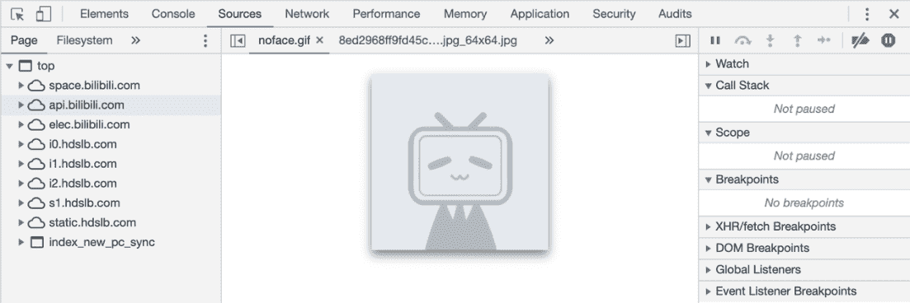
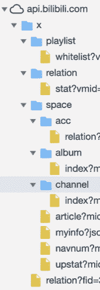
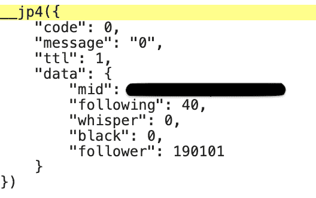

1 编写程序通过API获取网站的信息
-------------------------------

与第2章中提到的FaceBook
API不同，我国国内的视频网站已经不开放官方的数据API了，但是仍可通过对其网页进行解析得到相关信息。比如：国内大型在线视屏网站之一的哔哩哔哩，想要知道其中一个视频播主在B站上总共发了多少视频、播放量是多少等问题。在回答这些问题前，首先需要进行以下步骤来弄清楚从哪里获取这些数据。

#### 解析网页获取数据API链接

用Chrome打开哔哩哔哩某个播主的主页，然后点击按键F12开启Chrome的Web
Inspector。在弹出的Web
Inspector窗口中点击*Sources*进入该页面的源码视图（图F1-1）。

 

*图F1-1：Web Inspector的Sources界面*

 在Sources界面中可以看到*[api.bilibili.com]{.ul}*，用鼠标点击左侧的小三角将其内容展开（图F1-2）。

*图F1-2:展开后的api.bilibili.com中的内容*

从图F1-2中可以看到：api.bilibili.com中包含一个文件夹x，内容全部在x文件夹中，其中包含了playlist、relation以及space三个主要的文件夹。space文件夹中还包含了acc、album和channel文件夹。

通过对比bilibili中该播主的主页，可以猜测这些文件夹所代表的含义：

1.  playlist ： 该播主可播放视频列表；

2.  relation ： 与播主的关系；

3.  space ： 播主在哔哩哔哩上的主页空间；

4.  acc ： 浏览该播主主页的账号与播主的关系；

5.  album ： 播主的相册；

6.  channel ： 播主的视频频道。

从这些含义的字面上可以得出一些基本的判断：relation以及acc两文件夹中包含的信息不是想要的。逐个代开其他4个文件夹的内容后发现，以下API链接返回了我们想要的关于该播主的统计信息（图F1-3展示了在Chrome的Web
Inspector中显示的API内容）：

A.  [https://api.bilibili.com/x/relation/stat?vmid=xxxxxxx](https://api.bilibili.com/x/relation/stat?vmid=382666849)，含有：关注数、私信数、拉黑以及粉丝数的信息；

B.  [https://api.bilibili.com/x/space/navnum?mid=xxxxxxx](https://api.bilibili.com/x/space/navnum?mid=382666849)，含有：视频数、相册数等统计信息；

C.  [https://api.bilibili.com/x/space/upstat?mid=xxxxxxx](https://api.bilibili.com/x/space/upstat?mid=382666849)，含有：视频播放数、视频点赞数等统计信息。

 

*图F1-3：API链接返回的内容示例*

至此，我们掌握了一些该播主的统计信息，下一步就是把获取这些信息的步骤改由Python来完成。

**此处有些非常重要的提示：**

1.  读者的浏览器如果安装了某些广告屏蔽的软件，建议禁用；

2.  某些网站需要登陆后才能在API里面显示相关信息；

3.  某些网站对于加载其内容的浏览器有限制，在某些浏览器中不显示API信息。

#### 编写脚本完成自动化抓取

参考本书第2章和上一节中的内容，可以通过以下代码来获取播主的相关统计信息：

> *注：涉及到隐私以及可能的广告涉嫌，隐藏了该播主在B战上的ID编号。读者获取信息时可把代码中的"xxxxxxx"替换成想要抓取的播主ID（即:API链接后的mid对应的编号）。*

打开Jupyter
Notebook，在一个单元内输入以上代码后运行（Shfit+Enter），其输出如下：

然后，在Jupyter
Notebook的另一个单元中导入json并解析该输出为Python字典格式（代码及输出如清单F1-1）：

*清单F1-1：把API的输出转换为Python字典格式*

从列表F-1中可以看出，需要的数据主要保存在字典的data键中，通过创建一个名为summaries_data的Python字典来存储这些信息（见清单：F1-2）。

*清单F1-2：把数据存储在一个Python字典中*

接下来对在上一节中提及的另外两个API链接采用相同的方式把数据存储在一个字典中，为了叙述的简便以及对应本书中关于代码重复使用的原则，给读者呈现的是已封装为getBiLi_Data的函数（见清单F1-3）。

*清单F1-3：自定义函数getBiLi_Data*

清单F1-3中getBiLi_Data函数有3个参数：url_Lists，Id和headers。其中url_Lists是在上一节中通过解析网页获得的3个API链接中不含"xxxxxxx"的部分，以文本的数据类型保存在url_Lists（Python的list列表）中。Id是3个API链接中的"xxxxxxx"的部分，是某个播主在哔哩哔哩中的账号ID，该参数输入的是一串数字。headers是requests使用get()函数时导入的*请求头部信息*，如果不设置这个参数，则在获取3个API链接中的最后一个时会发生错误。把getBiLi_Data函数的运行结果赋予变量datA后的输出见列表F1-4所示：

*清单F1-4：在哔哩哔哩上获取的一个播主的统计信息*

仔细研究清单F1-4中的信息后，可以看到id为xxxxxxx的播主：40人关注（following）；0个私信（whisper）；0次拉黑（black）等等。还可以看到datA字典中嵌套着另一个字典（共两层结构），在把datA字典中的信息写入文件前需要把datA字典碾平（即：字典里面不要嵌套字典）。

*清单F1-5：碾平datA字典中的数据*

清单F1-5中代码是已经一个已经封装在名为Panel_Data()中的函数，该函数接收一个字典作为参数，输出一个碾平后的字典。接下来的任务是：从哔哩哔哩网站上通过随机生成的用户ID获取该用户的统计信息，并把获得的信息写入csv文件中，完整的代码如下：

*清单F1-6：完整的代码*

*清单F1-6：完整的代码（续）*

清单F1-6中完整代码的解析交给读者自我领会，如果有哪里不清楚的可以参考第2/3章的内容。
