# 3 在离线表格软件中打开和处理csv文件
-----------------------------------

由于在本书中提到的在线表格软件无法使用，本附录旨在通过离线表格软件------Microsoft
Excel给读者演示书中第6章和第7章中的步骤。关于Excel的界面特征与高级应用不是本附录的主要介绍的对象，读者如果对Excel不是很熟悉，建议在网上快速浏览一些相关的教程。

#### Excel文本导入步骤

首先，新建一个Excel文件（扩展名为：xls、xlsx），并将其重命名为"数据透视表演示"。然后打开这个文件，点击菜单"数据"中的"从文本"图标（图F3-1），此时会弹出Excel的安全警告，只要点击"确定"即刻。

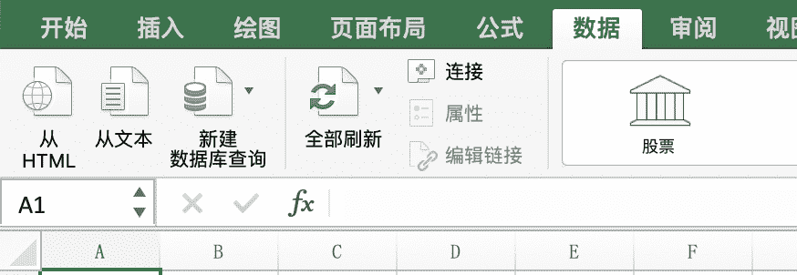 

*图F3-1：从文本获取数据*

在弹出窗口中选中文件sunneversets100_tweets.csv并打开，此时就会跳出一个"文本导入向导"的窗口（图F3-2）。在该窗口中选中"分隔符号"并在"文件原始格式"中选中UTF-8，然后点击"下一步"按钮。

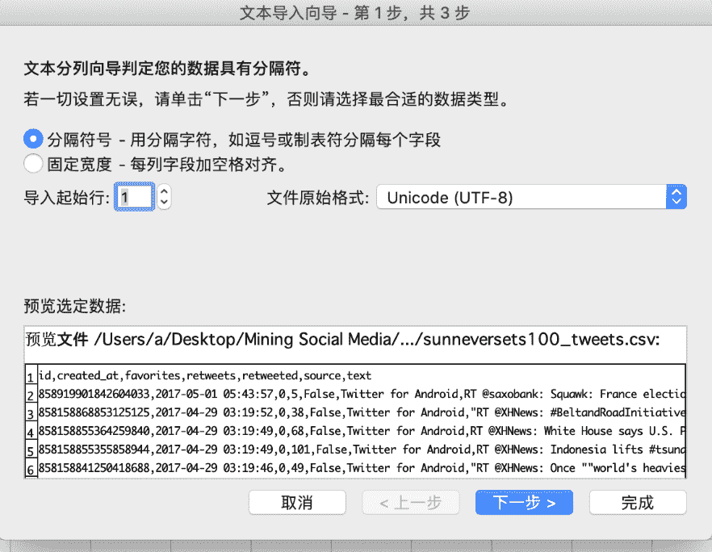 

*图F3-2：文本导入向导*

在"文本导入向导"窗口的步骤2中，依据csv文件中的分隔符选中"逗号"（图F3-3），然后点击"下一步"按钮进入步骤3。

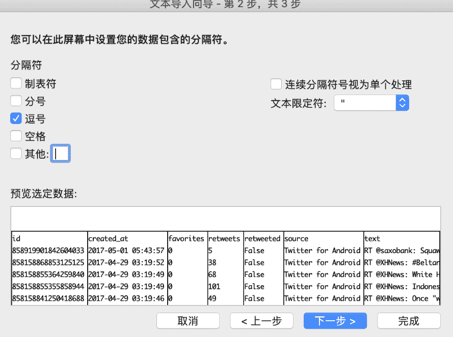 

*图F3-3：依据文本文件中的内容选择分隔符*

在文本导入步骤的最后一步，可以简单的对每一列的数据类型进行设置（图F3-4）。在这个步骤中把"id"数据列设置成"文本"类型，其余的保持"常规"，最后点击"完成"按钮并在另一个弹出框中点击"确定"完成文本导入步骤。如果读者想要在另一个工作表中保存导入的数据，则在弹出框中选择"新工作表"并"确定"即可。

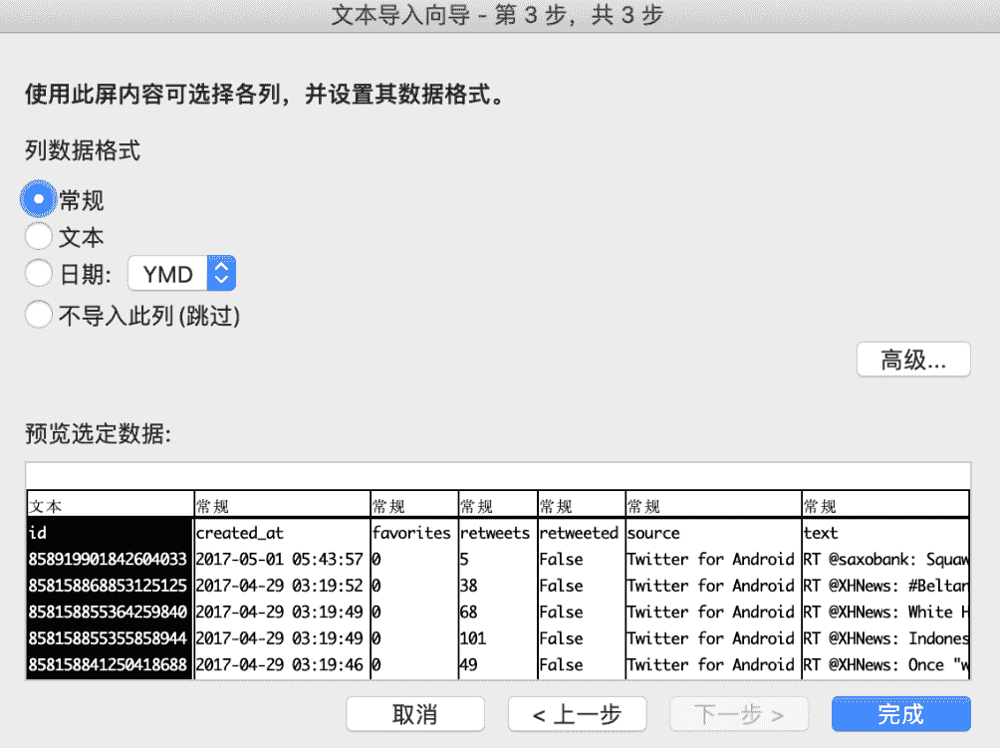 

*图F3-4：简单设置数据类型*

#### Excel数据处理（初步）

在进行对数据的处理之前，应先大致浏览一下导入的数据，确认这些数据呈现的样子是不是与心中所想的一样？

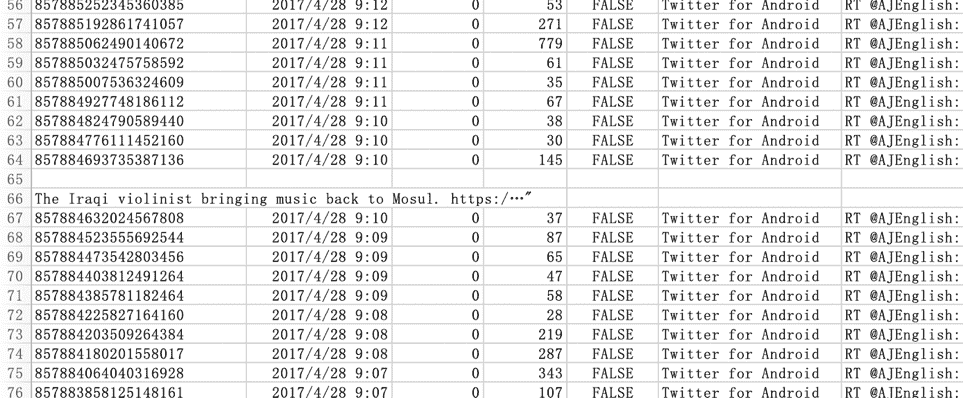 

*图F3-5：导入数据的部分截图*

在图F3-5中可以看到数据中有很多空行，也有很多行于每列的标题没有关联的信息。我们首先把这些无关的数据删除，但是在删除之前应该把这些原始数据保存，方法是：通过新建另一个工作表（图F3-6），拷贝原始数据至新建的工作表并保存，可以把新建的工作表重命名为"原始数据"。

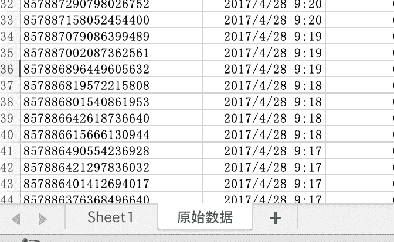 

*图F3-6：在Excel中点击图中的"+"号新建工作表*

###### 删除无关数据

回到需要处理数据的工作表中（Sheet1，请原谅译者的懒惰！），通过鼠标点击"id"所在的A列（列标）来选中整个"id"列（图F3-7，在之后文中采用"选中"来表示选择一行或者一列）。

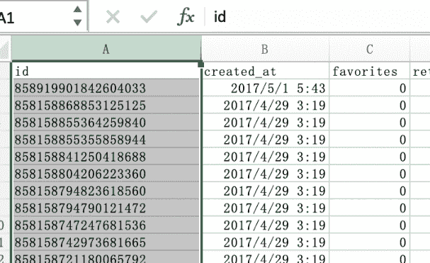 

*图F3-7：在Excel中选中整列数据*

在"数据"菜单中找到"升序"按钮并点击（图F3-8），在弹出窗口中选择"扩展选定区域"并点击"排序按钮"（图F3-9）后就完成了通过"id"数据列对整个数据集在Excel中的排序。

*图F3-8：排序按钮*

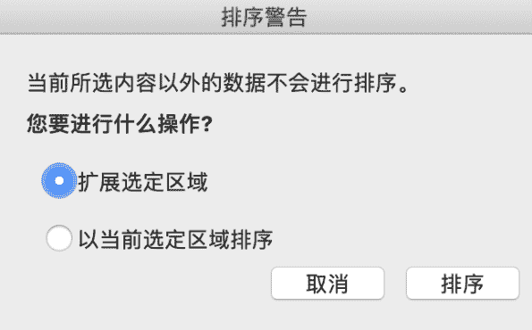 

*图F3-9：排序警告*

在图F3-9的两个选项中："扩展选定区域"是保证每行数据不会发生错位；"以当前选定区域排序"会不考虑同一行中的其他数据，只会把选定的数据列进行排序，其他列中的数据保持原样，这样就打乱了数据中每一行的关联，所以一般不会使用这个选项。

"升序"排序后的结果如图F3-10所示，读者也可以尝试"降序"排序的方式。这两个排序的方式并不是一尘不变的，需要按照被用于排序列的数据类型改变。比如把"id"数据列设置成"数字"类型，那么就要使用"降序"排序了。在图3-10中可以看到有13行无关的数据，在这里我们把其全部删除。但在其他的数据集处理中，有时需要认真的思考这些看上去无关的数据是否在之后的分析步骤中有用并是否应该保留。

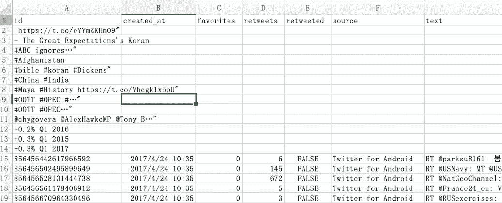 

*图F3-10：排序结果*

通过用鼠标连续选择（选中第一个需要删除的行标（Excel左侧：1、2、3...），按住Shift后点击需要删除的最后一行）来选中需要删除的行，然后右击鼠标在弹出菜单（图F3-11）中点击"删除"就能在表格中去除这些无用的数据了。

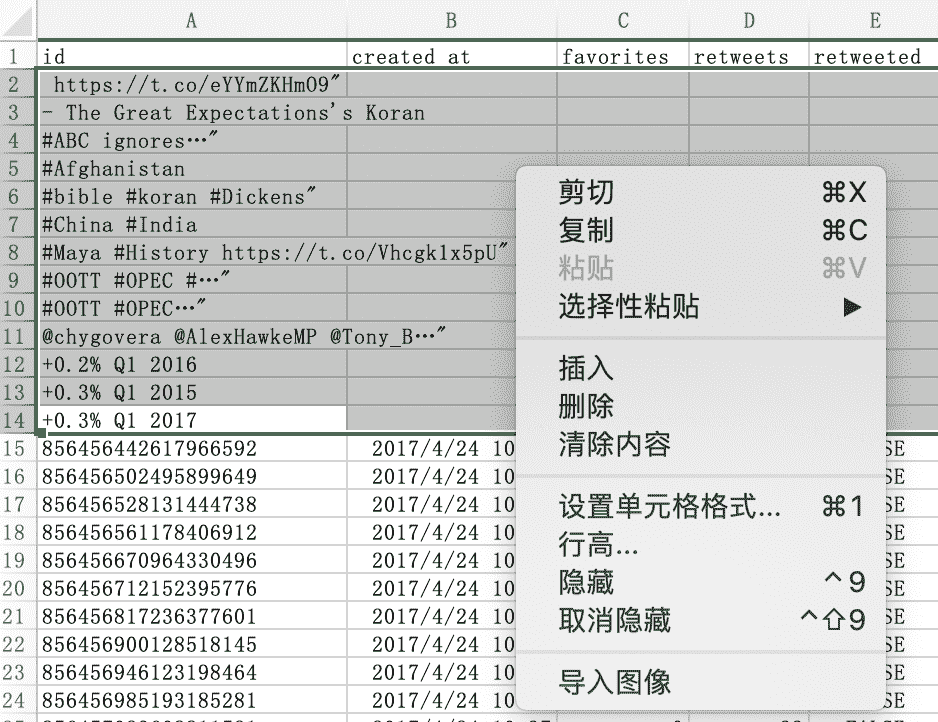 

*图F3-11：删除无用的数据*

通过删除无用数据保证了数据的一致性，我们还可以在其他的数据列中（如："created_at"）进行相同的操作。这里介绍一个更加快捷的方式来检查数据在某一列中是否存在"空"或者"不一致"的情况，选中包含列名称的第一行（一般第一行是标题行），在Excel中点击"开始"菜单，并在其中找到"筛选"按钮并点击。然后就会发现在"id"等列名单元格的右侧多了一个向下的三角按钮（图F3-12），该按钮就是这一列的筛选按钮。

 

*图F3-12：开启标题行"筛选"功能*

点击"id"所在单元格的筛选按钮后，会弹出一个窗口（图F3-13）。点击这个窗口的"搜索"栏下部，然后滚动鼠标至底部。我们发现"id"列中还有一些无关的数据，之前已经删除了排序后在"头部"的部分，那么剩下的无用的数据应该是在"尾部"。快速移动至"尾部"：鼠标选中"id"列的任何一个单元格，然后同时按"Ctrl+方向键中的向下按键"（在macOS中用Command替换Ctrl），我们还能发现一些无用的数据，选中它们并删除。

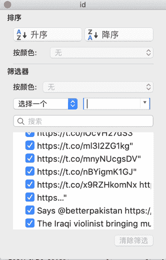 

*图F3-13："id"列的筛选*

读者可能会想看上去无用的数据是哪里来的呢？经过检查csv文件中的数据，发现这些对于我们现在无用的数据是一些推文的主题，可以直接删除。然后，使用单元格的"筛选"功能逐一查看其他数据列中是否存在不相关的数据，如有则删除整行数据。

###### 数据分列

在初步清除了一些无用的数据之后，观察"created_at"列发现其中即包含了日期信息的同时也包含了时间信息。我们需要把这些合并在一起的数据分开，这里就要使用到Excel的"分列"功能。在使用"分列"功能前，需要在"created_at"列后插入一个空白列，鼠标选中包含"favorites"的D列（列标）并右击，在弹出窗口中点击"插入"后会在"favorites"列前"created_at"列后插入一个空白列。然后选中"created_at"列，在"数据"菜单中找到"分列"按钮并点击，此时会弹出一个"文本分列向导"窗口。文本分列的操作在这个弹出窗口中的分成三个步骤，在这三个步骤中需要分别如何操作请看图F3-14。

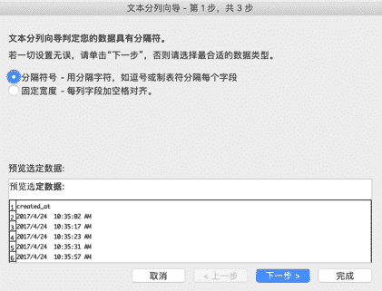 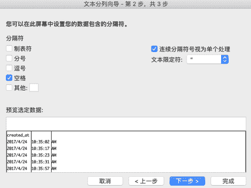 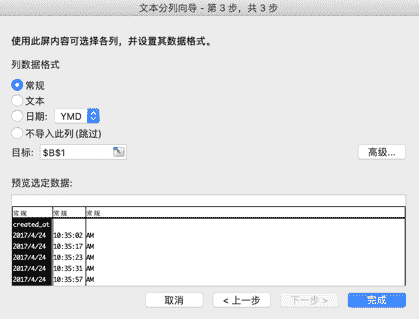 

*图F3-14：文本分列的操作步骤*

当点击完成后会弹出一个警告窗口，里面提示会有数据被覆盖（此时，点击窗口中的"取消"按钮）。重新检查图F3-14的最后一步发现"created_at"列被分隔成为3列，而不是预想中的两列。所以需要在"created_at"列后添加两个空白列后在进行上述的分列操作，其结果如图F3-15所示。

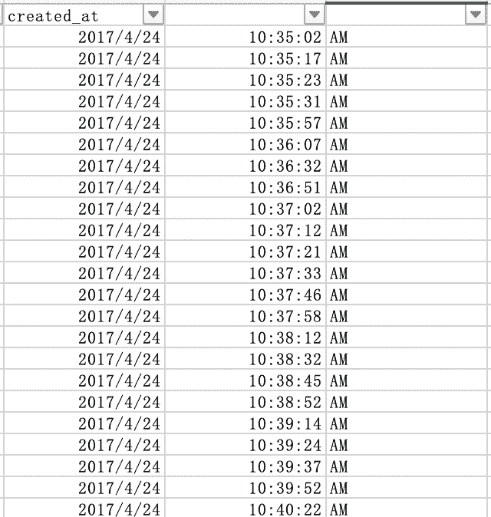 

*图F3-15："created_at"列的分列结果*

小提示：如果在数据的分析过程中仅仅想要使用的时间中的日期部分，我们可以直接把"created_at"列设置成为"日期"类别（Excel中称之为"类别"，在其他软件中称之为"数据类型"或"字符类型"）。

###### Excel数据类别（格式）

在前面的小节中，通过筛选和分列处理了部分数据列，但任然还有部分操作需要完成------对每列的数据设置数据各式类别（格式）。在前文中提到："文本导入向导"的最后一步以及"分列"的最后一步中可以简单的设置数据列的类别，但其中能够选择的类别有时并不能满足分析过程的需要。这个时候就需要对每列数据进行单独的类别设置：鼠标右击列标（如：A）▸"设置单元格格式"，在弹出窗口中选择"数字"选项卡（图F3-16）。

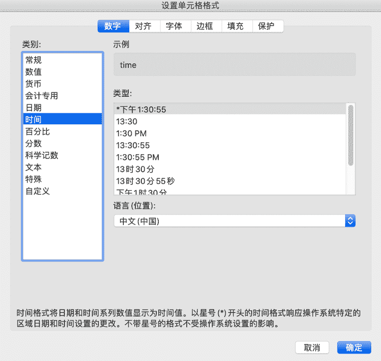 

*图F3-16：设置单元格格式*

可以观察到在"设置单元格格式"弹出窗口的"数字"选项卡中的数据类别比"文本导入向导"和"分列"中能够选择的选项多了许多，甚至可以设置"自定义"的数据类别。删除在分列时多出来的包含"AM"字符的列，给分列时分出的时间列一个"time"的标题（"created_at"右侧的空白单元格中），然后按照表F3-1的要求设置每一列的数据类别。

  数据列名称   数据类别（括号内是具体的类型）
  ------------ --------------------------------
  id           文本
  created_at   日期（\*2012/03/14）
  time         时间（13:30:55）
  favorites    数值（小数位数：0）
  retweets     数值（小数位数：0）
  retweeted    文本
  source       文本
  text         文本

*表F3-1：数据列的数据类别*

至此，我们完成了在使用数据透视表之前对现有数据的处理，但这样的处理仅仅是一种初步的结果。在使用Excel分析的后续过程中，依据不同的需求可能还需进一步对数据进行设置。

#### Excel数据透视表（初步）

###### 创建数据透视表

经过对数据的初步处理后，就可以进入对数据进行汇总的过程，此过程在Excel中可以采用图形化的方式进行------"数据透视表"。

选中包含数据的任何一个单元格，然后依次点击"插入"菜单▸"数据透视表"图标（图F3-17），之后就会弹出"创建数据透视表"窗口（图F3-18）。

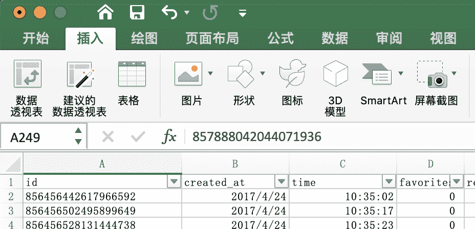 

*图F3-17：插入数据透视表*

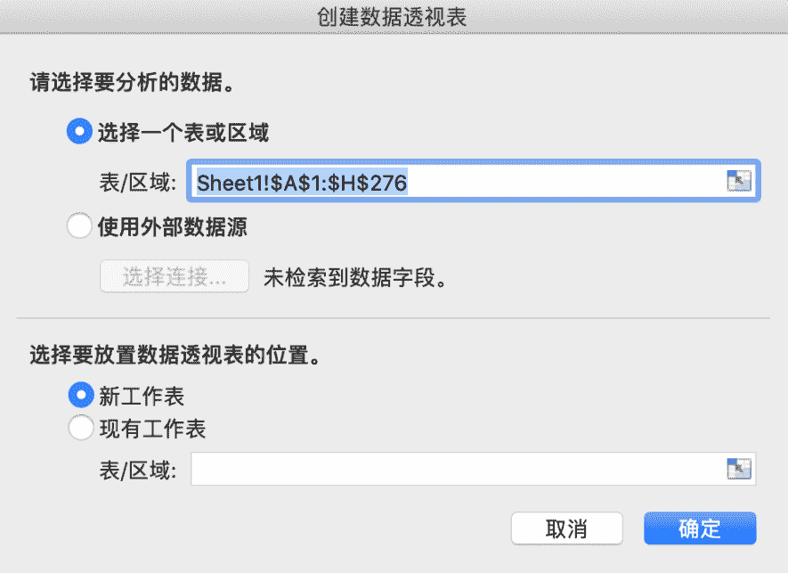 

*图F3-18：创建数据透视表窗口*

在"创建数据透视表"窗口中选择"选择一个表或区域"，从图F3-18可以看到Excel已经自动帮助我们选择了想要导入数据透视表的区域，当然也可以直接"使用外部数据源"（包括：文本文件，数据库等等）。在"选择要放数据透视表的位置"中选中"新工作表"，这里不建议在"现有工作表"的某个位置中添加数据透视表，因为如果读者的数据每天都在增加，那么增加的数据可能会覆盖到数据透视表的位置，从而导致混乱。在点击"确定"后，Excel就会自动添加一个新工作表，里面已经创建了一个数据透视表，把这个新的工作表重命名为"数据透视1"（图F3-19）。

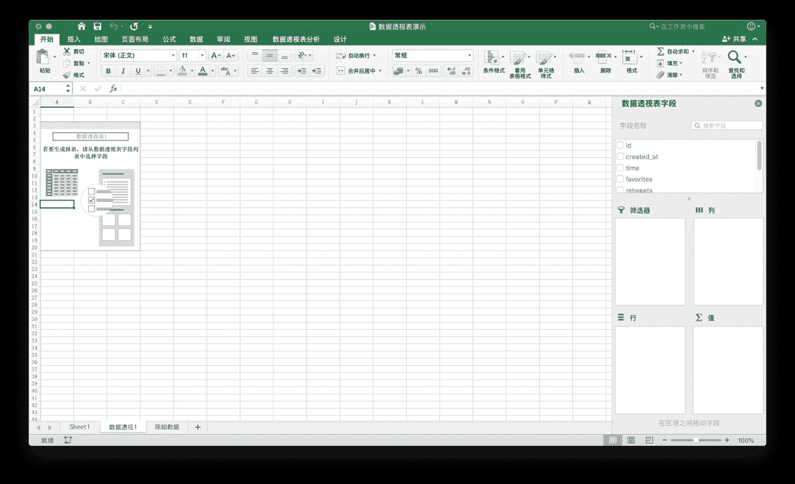 

*图F3-19：数据透表样例*

在右侧的"数据透视表字段"中显示了哪些数据可应用于该数据透视表中。通过用鼠标把这些字段拖入"行"、"列"以及"值"中就可以对数据进行汇总。现在，把"created_at"拖入"行"中并把"retweets"拖入"值"中，就会显示如图F3-20所示的表格。

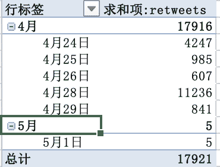 

*图F3-20：简单的数据透视表*

从上图中可以看到"行"中的"created_at"被显示为按照月份以及日期自动排序（这就是按照表F3-1设置数据类别的好处），"retweets"的前面多三个字"求和项"，这三个表明"retweets"中的数据被按照日期计算每天的"retweets"（即：转发）量。通过鼠标右击"值"中的字段并点击"字段设置"（图F3-21）来更改是"求和"还是"计数"等

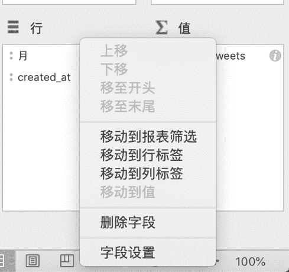 

*图F3-21：字段设置*

###### 创建数据透视图

在上一节中，我们创建了一个简单的数据透表，接下来就可以使用这个透视表来创建一个"数据透视图"。鼠标选中数据透视表的任意位置，Excel会在菜单栏中多出两个："数据透视表分析"和"设计"。（图F3-22）

 

*图F3-22：数据透视表分析*

通过点击"数据透视表分析"菜单中的"数据透视图"就可以非常简单的创建一个透视图了（图F3-23）。

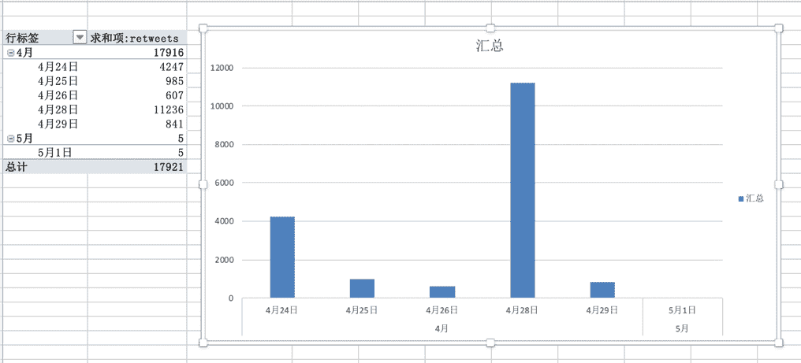 

*图F3-23：数据透视图*

是不是很简单！如果没有对数据进行认真的处理并不能够这么简单的创建一个汇总图形。读者可以尝试不对数据进行处理是不是能够创建与图F3-20/23一样的透视表和透视图。这个要求就留给读者作为练习题完成。

#### 概要

正如本附录开头所述，本附录仅仅展示了Excel中部分的基础功能。如果读者并不喜欢编程，Excel也是非常强大的处理和分析工具。仅通过点点鼠标就完成了复杂的分析工作是谁都喜欢的，但这个过程仍然需要人的参与。如果在每天工作量不大的情况下，点点鼠标是非常开心且具有成就感的，但是每天有成千上万的表要与本附录中的例子一样处理，就是读者24小时不睡觉也不能完成。所以学习编程，然后让计算机按照设定处理才是解放自己最好的方法（按照经济学的原理：扩展我们自己的生产者曲线）。

索 引
=====

aggregating data聚合数据, 110angle brackets尖括号(\<\>), 13anonymous
functions 匿名函数, 155APIs (Application Programming Interface), 32API
keys API密钥, 34, 35, 62append() 函数, 75apply() 函数, 155archives 归档,
66arguments 参数, 26artificial intelligence 人工智能, 164ascending order
升序排序, 115assignment operator 赋值操作符(=), 24Atom, 45attributes
属性, 15backend languages 后端语言, 21Baumgartner，Jason,
136beautifulsoup4库, 50Bird，Steven, 164Boolean values 布尔值, 145bots
机器人, 104browsers 浏览器, 17calling functions 调用函数, 26calling
调用, 26Cascading Style Sheets 层叠样式表, 14causation 因果关系, 116cd
command cd命令, 47cells 单元, 131chaining 链接, 73change directory
改变操作目录, 47charts 图表, 120Chrome, 17classes 类, 15clients 客户,
32closing tags 结束标记, 13code-sharing platforms 代码共享平台, 35coding
resources 编程资源, 163color property 颜色属性, 14color scale formatting
色阶格式, 127column chart柱状图, 125command line interfaces 命令行接口,
128Command Prompt命令提示符, 21comma-separated values 逗号分隔的值,
49comments 注释, 49comparison charts 图形对比, 121composition构成,
123concatenation拼接, 22conditional formatting 条件格式, 126conditionals
条件语句, 29Cooper，Katherine, 78correlation 相关关系, 116Cox, Amanda,
104crawlers 爬虫, 80credentials 证书, 34csv库, 49data analysis 数据分析,
102data dictionary数据字典, 144data types 数据类型, 22DataFrame 数据框,
133datetime库, 49declaring functions 声明函数, 27declaring loops
声明循环, 28defining functions 定义函数, 27descending order 降序排序,
115describe() 函数, 149developer tools 开发工具, 17dictionary 字典,
53DictWriter() 函数, 75Digital Forensic Research Lab 数字法医研究实验室,
104distribution 分布, 122div元素, 14documentation 文档, 33donut charts
环状图, 123Downey，Allen B., 163dropna() 函数, 144elements 元素,
13encode 编码, 64engagement metrics 参与度指标, 141error messages
错误消息, 34ethics 伦理, 80expressions 表达式, 22Facebook, 6filepaths
文件路径, 47filtering data 筛选数据, 145find() 函数, 72floats 浮点数,
22for 循环, 28formatting data格式化数据, 104formulas 公式, 112functions
函数, 26General Data Protection Regulation（GDPR）, 66get_text() 函数,
73GOOGLE SHEETS, 105head() 函数, 138Heisler, Sofia, 163hexadecimal
colors 十六进制颜色, 15home pages 主页, 13HTML (HyperText Markup
Language) 超文本标记语言, 13if clauses（if子句）, 29iferror()公式,
118iloc\[\] 方法, 139indentation 缩进, 14inheritance of styles 风格继承,
15inline 内联, 15integer-location-based indexing 基于整数位置的索引,
133integers 整数, 10internal style sheets 内部样式表, 15Internet Archive
互联网档案馆, 136IPython Notebooks, 128iteration 迭代, 28Java 脚本,
20JavaScript对象标记(JSON), 34joining data sets 联接数据集, 116JSON
objects JSON对象, 35json 库, 49json.load() 函数, 53Jupyter Notebook,
128keys 密钥, 35key-value pairs 键-值对, 38Klein, Ewan, 164len() 函数,
26libraries 库, 49Linder, Lindsey, 78list 列表, 25logical operators
逻辑运算符, 29loop循环, 28Loper, Edward, 164Lytvynenko, Jane, 42machine
learning 机器学习, 164macOS, 9make_csv() 函数, 62matplotlib 库,
151McKinney, Wes, 133mean 均值, 142mean() 函数, 149measures of central
tendency 集中趋势的度量, 142median 中位数, 142merging data sets
合并数据集, 116minified 最小化, 88modifying and formatting data
修改和格式化数据, 108NaN values NaN值, 144Natural Language Processing
自然语言处理, 164Natural Language Toolkit 自然语言工具包NLTK, 164nested
elements 嵌套元素, 14nextPageToken键, 58null values 空值,
144one-dimensional data sets 一维数据集, 133open() 函数, 52overloading a
server 超载网站的服务器, 80pagination分页, 58pandas库, 133panel
data面板数据, 133parameters 参数, 33parsing 解析, 71paste special
选择性粘贴, 114pie charts 饼图, 123pip 库, 50pivot tables 数据透视表,
110placeholders 占位符, 144plotting data 绘制数据, 161prcoess 过程,
102print() 函数, 24prompts 提示符, 22properties 属性, 15pseudocoding
伪代码, 49PyPI, 50Quealy, Kevin, 104rate limit 速率极限, 64raw data
原始数据, 102Reddit, 128Reinhart, Alex, 164rendering 渲染，呈现,
12requests 库, 50resampling data 对数据进行重采样, 159research questions
研究问题, 40resources 资源, 164reusable 重用, 26robots exclusion
protocol 机器人排除协议, 80Rocha, Roberto, 80scatterplots 散点图,
123scikit-learn 库, 165series 序列, 133set_index() 函数, 159Sheets,
102Silverman, Craig, 42Singer-Vine, Jeremy, 42single-color formatting
单色格式, 126sleep() 函数, 100sort_values() 函数, 147sorting and
filtering data 排序和筛选数据, 114spaCy, 164spiders 蜘蛛, 80spreadsheets
电子表格, 106standard library 标准库, 49statistical analysis 统计分析,
164*Statistics Done Wrong* 统计会犯错, 164string concatenation operator
字符串拼接操作符, 23style attribute 样式属性, 15style sheets 样式表,
15summarizing data 汇总数据, 146summary data 汇总数据, 102syntax
highlighting 语法高亮, 45tail() 函数, 138templates 模板, 61third-party
第三方, 49time periods 时间段, 115time series 时间序列, 124timestamp
时间戳, 74transposing data 转置数据, 138Unicode 转换格式, 64unminified
非最小化, 88unordered lists 无序列表, 90URL-based API calls
基于URL的API请求, 33URLs (uniform resource locators) 统一资源定位器,
13User-agent用户代理, 80virtual environments 虚拟环境, 129visualizations
可视化, 120void elements 空元素, 13Web Inspector, 17web robots
web机器人, 80websites 网站, 12Wheelan, Charles, 164Wickham, Hadley,
164Wikipedia 维基百科, 83writeheader() 函数, 75writer() 函数,
52writerow() 函数, 52YouTube, 32

记者和调查人员的数据分析
===============================================================================================================

虚假的推特账户是否有助于左右总统选举？Facebook和Reddit档案能告诉我们什么是人类行为？在挖掘社交媒体方面，BuzzFeed新闻高级记者Lam
Thuy
Vo向您展示了如何使用Python和关键数据分析工具来查找隐藏在社交媒体中的故事。

无论您是专业记者、学术研究人员还是公民调查人员，都将学习如何使用技术工具从社交媒体收集和分析数据，用以构建引人注目的、数据驱动的故事。

学习如何：

● 编写Python脚本并使用API从社交网站收集数据

● 下载可以挖掘见解的数据存档

● 检查从网站下载的HTML以获取有用的内容

● 使用Google Sheets格式化、聚合、排序和筛选数据

● 创建数据可视化以演示您的发现

● 使用Python、Jupyter Notebook和Pandas库执行高级数据分析

● 把所学的运用到自己的研究中去

社交媒体充斥着成千上万的等待被讲述的隐藏故事。学习使用专业人士用来编写自己的数据驱动故事的数据侦查工具。

关于作者
========

 Lam Thuy
Vo是BuzzFeed的一名高级记者，其专业领域处于技术、社会和社交媒体数据的交汇点。曾领导团队为华尔街日报、美国半岛电视台和美国国家公共电台的金钱星球进行新闻报道，这些报道讲述了美国和整个亚洲的经济故事。她还担任了10年的教育工作者，在此期间开发了新闻编辑室内容的培训项目，为世界各地的记者举办了讲习班，并为克雷格·纽马克·纽约市立大学新闻研究生院(Craig
Newmark CUNY Graduate School of Journalism)开设了长达一个学期的课程。

***THE FINEST IN GEEK ENTERTAINMENT™***

[[www.nostarch.com]{.ul}](http://www.nostarch.com/)

[^1]: 附录中代码的下载地址：https://github.com/xushengun/SheJiaoMeiTiWaJue

[^2]: 静态网页，随着html代码的生成，页面的内容和显示效果就基本上不会发生变化了------除非你修改页面代码。而动态网页则不然，页面代码虽然没有变，但是显示的内容却是可以随着时间、环境或者数据库操作的结果而发生改变的。（源自：百度百科）
