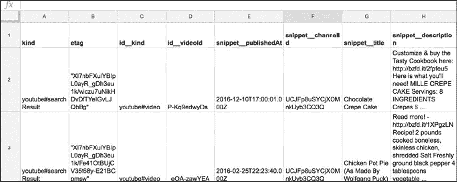
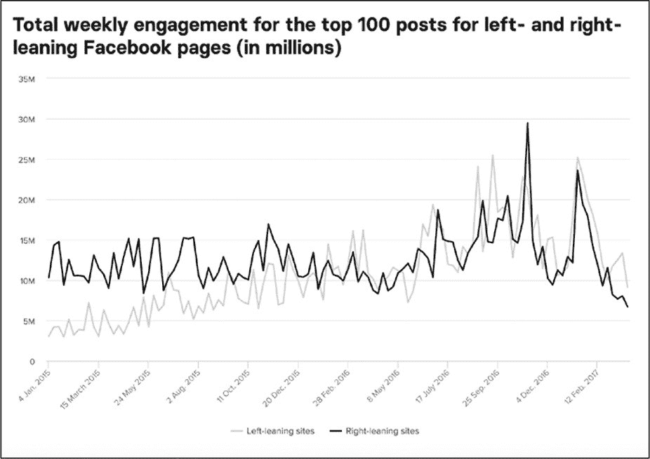
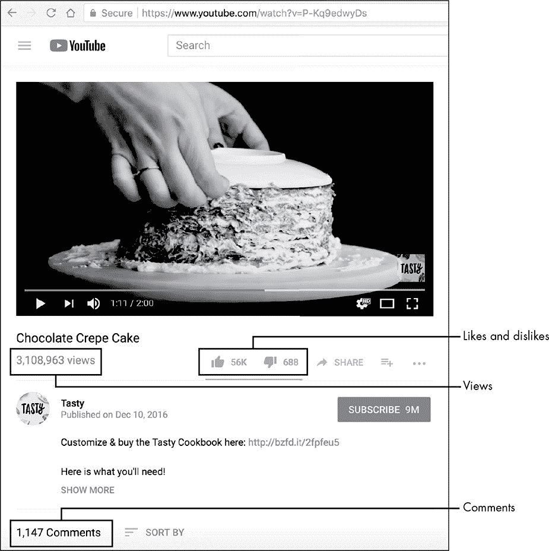

# 2 从哪里获取数据
---------------------------------------------------------------------------------------

当使用社交媒体时，我们的行为会留下痕迹。Facebook上的点赞，Twitter上的转发，Instagram上的一颗心------每一个动作都代表着互联网某处记录的一个数据点。通过用户同意这些公司的服务条款，允许他们存储这些数据，反过来这些公司也可以向公众提供数据。

这些公司允许第三方通过应用程序编程接口(API)访问这些数据宝库。API就像社交媒体平台和希望从中获取信息的开发人员之间的中间人。

在本章中以YouTube为例，更详细地解释什么是API，以及可以从中获取哪些类型的数据。

#### 什么是API？

API是Application Programming
Interface的缩写，即应用程序编程接口。从最基本的层面上看，API是允许程序员访问其他开发人员代码的接口。一些程序员使用API访问在线平台上的数据，这样他们就可以制作自己的应用程序。例如，第三方开发者可以使用官方的Instagram应用程序的API，该API允许用户使用非官方的应用程序向他们的Instagram
Feed发布图片。换句话说，Instagram
API允许开发者将自己的代码连接到Instagram管理其帐户的用户。

正如稍后即将讨论的，API还允许开发人员使用脚本（一个与web上的服务器和数据库通信的程序）来请求数据。

为了更好地理解API，采用一个例子进行类比。例如：你是餐馆的顾客，API就像一个服务员，它给你一组选项、帮你点餐、取餐，然后拿给你。当然餐厅老板决定菜单上有哪些什么菜肴。餐厅老板还控制着菜肴的摆放和分量。菜单详细说明了你可以点哪些菜肴，这些菜肴的名字，以及这些菜肴的一半构成份。

就我们而言，社交媒体公司代表餐馆老板，开发人员(或客户)代表食客，菜单上的菜代表我们试图收集的数据。客户端是我们用来上网的任何技术，就像浏览器、手机、桌面的一个应用程序。

Facebook或Twitter这样的公司是否提供API完全取决于：可以通过一个或多个API提供数据，也可以选择不提供任何数据。而且，即使公司允许第三方访问其数据存储，它通常也会限制可用的数据，并可以随时更改共享的数据。公众对隐私问题的愤怒、旨在保护人们数据的新法律法规、以及涉及社交媒体公司的新闻事件，都对公司是否提供数据的决策产生了影响。一些公司甚至可能对访问他们的数据进行收费。

要了解一家公司通过其API向开发人员提供了哪些信息方法是通读该公司的文档，然而文档是说明手册的一种时髦称谓而已。令人非常不愉快的是：文档并没有被标准化。即使是最有经验的研究人员也会感到迷失方向，尤其是当他们刚开始编写代码。这在一定程度上是因为文档通常是针对应用程序开发人员，而不是研究人员、营销人员或其他非开发人员。

查找一家公司提供哪些可用信息的最佳方法是简单地搜索该公司在谷歌（国内是Baidu）上的API。

#### 通过API获得数据

现在已经大致了解了API的工作方式，接下来研究如何使用API获得数据。

如前所述，第三方一般使用脚本从API请求数据。这些脚本通常是文本文件，由计算机之类的机器执行或运行。可以将把脚本想象成一个为您执行任务的小机器人。这个机器人可以与API通信，向API请求数据、读取接收到的数据、并根据数据创建电子表格。

脚本通常通过URL与API通信，如同访问网站时使用的URL。使用URL与API通信被称为基于URL的API请求(API调用)。与大多数其他URL一样，可以把API调用粘贴到任何浏览器中，浏览器将返回您请求的基于文本的数据。当使用脚本进行API调用时，脚本将接收浏览器中显示的信息。

以谷歌的YouTube
API为例。您可以使用这个API来访问大量数据，包括YouTube频道的描述数据或在一段时间内接收到的访问量。通过在URL中包含数据，可以告诉API需要调用哪些数据。对于本练习，我们将请求BuzzFeed
Tasty YouTube页面上发布的帖子的数据提要。为此使用如下API调用：

https://www.googleapis.com/youtube/v3/search?channelId=UCJFp8uSYCjXOMnkUyb3CQ3Q&part=snippet
。

URL的每个部分都有不同的用途。其中有两种类型的字符串构成了一个API调用：一种是base，它表示正在使用的API；另一种是各种参数，它告诉调用希望获取哪些数据并传递有关您的信息(即请求信息的一方)。在之前的类比中，base类似正在用餐的餐厅，参数是可以选择的单个菜单项目。

 

此例中的API基于*https://*[*www.googleapis.com/youtube/*
。](http://www.googleapis.com/youtube/%20。%20)该API把浏览器或Python脚本定向到谷歌的YouTube
API上。调用的下一部分是一个参数，该参数告诉谷歌需要使用的API版本。社交媒体网站经常更新，当网站更新时API也随着更新。版本由一个正斜杠与base分隔开。在本例中我们希望使用API的v3版本(由于这些版本经常更新，您应该参考文档以确保使用的是最新版本)。下一个参数是search，该参数指定搜索YouTube的视频。

接下来指定要搜索的内容。此例中需要寻找来自BuzzFeed
Tasty频道的视频，该频道的YouTube频道ID为UCJFp8uSYCjXOMnkUyb3CQ3Q。一般在YouTube频道URL的末尾找到频道ID。例如，Tasty频道的URL为：https://www.youtube.com/channel/UCJFp8uSYCjXOMnkUyb3CQ3Q。通过输入参数的名称channelId来调用频道ID参数，具体为在channelId后面跟一个等号(=)和长的频道ID：channelId=UCJFp8uSYCjXOMnkUyb3CQ3Q。

现在有了一个URL地址，完成对API进行第一次调用的而准备。在下一章中通过Python脚本进行此调用，但是现在只需将API调用粘贴到浏览器中。此步操作可以立即看到API的响应。完成该操作后，浏览器应该返回清单2-1中的信息。

*清单2-1:API调用在浏览器中返回的代码，读者的响应可能看起来略有不同*

API响应的结构是JavaScript对象标记(JSON)，这是API用来传递数据的格式。在接下来的页面中会更详细地讨论JSON。

仔细查看该API返回的JSON数据发现单词error，error表示发生了问题，代表该API无法从BuzzFeed
Tasty频道获取请求的帖子。

处理代码的过程中经常需要阅读和理解错误（error）消息。作为一个初学者可能会觉得把大部分时间都花在了测试和修复代码上而没有实际的产出。但是在找到正确方法之前还是会犯错误，一旦经验积累起来后，就很容易改正这些错误。

大多数情况下错误消息提供了关于出错原因的线索。如果更仔细地检查API错误的响应，可以看到API返回了一个"消息"和一个错误通知"未经过身份验证的使用超出了每日限制"，继续使用需要注册。（Daily
Limit for Unauthenticated Use Exceeded. Continued use requires
signup.）"

若要修复这个错误需要一个"API密钥"，这是一种将标识自己API的方法。YouTube和其他有API的网站想要知道谁在使用他们的API，所以有时会要求你注册开发者证书，这是开发者用来获得API访问权限的一种形式。凭证类似于用户名和密码。作为获取API使用权限的交换，社交媒体公司会跟踪用户，以防有人滥用API。

###### 获取一个YouTube API密钥

对于YouTube等社交媒体网络，通常可以在该平台的网站上获取密钥。现在开始尝试从YouTube获取密钥。如果要注册Google的YouTube开发者密钥，首先需要注册一个Google帐户。如果没有请在*https://www.google.com*上创建一个。完成此步骤操作后，登录并导航到Google为开发人员设置的单独页面：*https://console.developers.google.com/apis/credentials
。*

 请按照谷歌的说明创建凭证，特别是API密钥。

完成创建一个通用API密钥后，密钥的默认名称是"API密钥"，可以通过双击密钥名称来重命名。本例中被重命名为"数据收集密钥"。

有了密钥之后，在浏览器中导航到Library页面。谷歌提供了各种各样的API，因此需要启用对所需的特定API的访问。在浏览器中导航到YouTube数据API
v3并单击Enable。至此可以通过API密钥访问YouTube了。

该API密钥连接到您的谷歌帐户，它的作用类似于允许您访问谷歌API的用户名和密码。所以应像对待其他用户名和密码一样对待API密钥。以往编写并发布脚本到代码共享平台(如GitHub)的开发人员会不小心在网上发布他们的密钥。如果犯了同样的错误，就会产生严重的后果。如有人可能会滥用您的密钥，导致在将来无法访问该API密钥代表的服务。

###### 使用凭证检索JSON对象

获得用户凭证后就可以使用URL再次访问API。尽管每个API都不相同，但是通常API会要求您将API密钥直接输入到API调用中。如果发现之后使用其他API不是这种情况，那么应查看该API的文档找出在何处输入凭证。对于Google的YouTube
API可以在原始API调用指定的参数之后，将API密钥作为其自己的参数添加到URL中。输入以下URL，用获得的API密钥替换\<YOUTUBE_API_KEY\>：https：//www.googleapis.com/youtube/v3/search？
channelId = UCJFp8uSYCjXOMnkUyb3CQ3Q＆part = snippet＆key =
\<YOUTUBE_API_KEY\>。

至此应该收到一个包含数据的API响应！清单2-2是API调用在浏览器中返回数据的示例。因为BuzzFeed页面是不断变化的，你的数据看起来应该会不同，但返回的数据结构应该是一样的。

*清单2-2：YouTube API返回的示例数据*

 查看返回代码后可以注意到，API响应仍然是JSON。也许有些让人不知所措，但是可以将JSON数据转换成一种更熟悉的格式---表格（图2-1所示）。阅读API响应中的一些字符串，能看到数据是来自BuzzFeed
Tasty YouTube频道的五个视频的快照。

*图2-1：JSON数据转换成表格格式*

刚开始接触是，JSON格式的数据看起来感觉非常混乱、非常复杂，所以把每个部分一一分解后就可以更好地了解数据的结构。JSON数据总是存储在两个大括号({})之间。每个post都存储为JSON对象，每个对象中的数据点存储为**键-值对（*key-value
pairs*）**。如第一个post包含以下数据点：

冒号前的字符串被称为键*key*➊,冒号后的字符串是一个与键*key*关联的值*value*➋。键*key*代表了数据的类型------可以将这个键*key*看作表格列的标题。值*value*包含实际数据，如：字符串、整数或浮点数。在API文档中可以查阅到这些数据点是哪种数据类型。在本例中键*key*被称为"*publishedAt*"，根据YouTube的文档，该键*key*描述了一个帖子或评论创建的时间和日期。本例中的值*value*（"*2016-12-10T17:00:01.000Z*"）是一个用UTC格式格式化的时间戳。UTC是一种将日期和时间信息存储在一个字符串中的标准化方式。

API返回哪种数据完全取决于提供数据的社交媒体平台。这也意味着社交媒体平台决定了返回数据的键值。例如，谷歌决定调整发布文章的日期和时间*publishedAt*代替*日期date*或*published_on*。顺便提一句，这是谷歌及其API的特有风格（译者说：改用Baidu吧！Baidu的风格更加夸张）。

*清单2-3：YouTube上一个名为"Chocolate Crepe Cake"的视频片段*

如清单2-3所示，每一个YouTube视频信息存储一组花括号{}➊之间,每一个JSON对象是由一个逗号分开➌。在这些大括号中有四个键("publishedAt"、"chann"、"title"、"description")和它们所关联的值("2016-12-10T17:00:01.000Z"，"UCJFp8uSYCjXOMnkUyb3CQ3Q"，"Chocolate
Crepe Cake"，"Customize & buy the Tasty Cookbook here:
http://bzfd.it/2fpfeu5 Here is what you'll need! MILLE CREPE CAKE
Servings：8 INGREDIENTS Crepes 6
..."，respectively)，这些键和值与前面的示例一样是成对显示的，每一个键-值对之间采用逗号分隔➋。

再次查看清单2-2中原始代码的部分片段(参见清单2-4)。

*清单2-4：重新访问YouTube API返回的示例数据*

清单2-4中显示所有的推文都嵌套在一对方括号(\[\])中。(注意，上面的清单2-4在本书中被截断了，虽然您应该能够在API调用的结果中看到开括号和闭括号，但是只能在这些页面中看到开括号。)所有这些数据的前面依次是字符串"items"，然后是冒号。这表示键"items"包含一个数据点列表------在本例中是BuzzFeed的Tasty
YouTube频道的视频。"items"键值对存储在另一组大括号({})之间，大括号组成整个JSON对象。

至此，完成了如何从API请求数据的过程，以及如何读取返回的JSON响应，接下来看看如何调整返回的数据以满足我们的需要。

###### 使用数据回答研究问题

可能已经注意到，API调用返回的数据在视觉上相当稀疏。如果不指定需要的数据类型，API会只返回基本信息以及提供默认数据点，这不是我们想要的数据。例如，清单2-5中包含清单2-2中API调用返回的一个视频的信息。

*清单2-5：API调用的示例响应，仅包含关于视频的基本信息*

此数据项对应于图2-2中BuzzFeed中Tasty频道上的视频。

 

*图2-2：清单2-5所示的视频截图*

在线视频中显示的数据比通过API接收到的数据要多，如：观看和评论的数量。这些信息以及更多的信息都可以通过API获得，但是需要考虑想要获得的数据类型以及想用它来回答什么问题。具体来说需要做两件事。首先，需要为研究设定目标。设定研究目标可能是**最重要**但在现实过程中考虑最少的步骤，对研究有一套清晰的问题或假设会告诉你如何收集数据。其次，应当查阅API文档，看看是否有需要的数据来满足研究目标。

采用这种方法的一个很好的例子是BuzzFeed新闻的故事"Inside the Partisan
Fight for Your News Feed"
(https://buzzfeed.com/craigsilverman/inside-the-partisan-fight-
for-your-news-feed)。本文作者与Craig Silverman，Jane Lytvynenko，Jeremy
Singer-Vine组成的项目组通过Facebook的Graph
API从452个不同的Facebook页面收集了400万篇帖子。总共收集了数百万的数据点，这些数据点通过简单地分析不能无法找到任何有意义的模式或趋势。为此首先需要缩小想要使用的信息的范围。

由于越来越多的新闻机构依靠Facebook这样的第三方来接触他们的受众，作者的项目深入研究了新老机构在Facebook上是如何相互比较的。项目组决定分析[左倾]{.ul}和[右倾]{.ul}新闻机构的受欢迎程度（世界上哪有那么多左右之分呢？本文不谈论政治，作者也仅仅是用此项目当作一个事例。），受欢迎程度分析基于这些新闻机构的追随者数量和每个页面所获得的参与度(反应和评论)。将数据缩小到两个类别后就可以画出随时间变化的信息，如图2-3所示。

 

*图2-3：BuzzFeed News分析了左倾和右倾Facebook页面的表现*

从上图中可以看到：随着时间的推移，左倾的Facebook页面的参与度在不断增加。为了找到研究问题的答案，不仅需要访问信息，而且还需要过滤信息。

如果想要对BuzzFeed的"美味频道"(Tasty
channel)的内容在一段时间内的受欢迎程度进行类似的分析，首先需要考虑的是：可能有助于回答这个问题的数据类别。例如，有多种方法来衡量一个视频的受欢迎程度，如：观看、喜欢、不喜欢和评论等等的数量，然后决定要用哪种方法。

 在某些情况下，社交媒体平台帖子的视觉布局是决定如何回答研究问题的好方法。例如，图2-4可以告诉我们在BuzzFeed的"美味频道"(Tasty
channel)的流行度分析中使用了哪些数据。

*图2-4：在清单2-5中看到的文章的注释截图*

要理解BuzzFeed内容的性质，最好的方法可能是看它的视频属性(如：每个视频的标题和描述)。例如，可以使用观看次数和支持或反对票数来衡量一个视频的受欢迎程度。最后但并非最终，可以使用视频时间戳来确定哪些内容在一段时间内表现良好。

如何访问上述提到的数据呢？通过查看API文档确定哪些信息是否可用。正如上节中提到的，像谷歌这样的庞然大物提供了许多API和各种文档集。我们对YouTube的数据API感兴趣，它的文档位于https://developers.google.com/youtube/。每个API的组织方式不同，因此您需要阅读开始使用的任何API的介绍或概述。在介绍如何使用谷歌的YouTube
API之前，先回顾一下关于它的一些基础知识。

###### 优化API返回的数据

可以使用各种参数进一步缩小范围或指定希望收集的信息的种类。打开YouTube的API文档(https://developers.google.com/youtube/v3/docs/search/list)，向下滚动到Parameters表。左列按名称列出参数，右列提供描述和使用指南。在查找数据时，请阅读每个参数的概述同时找到与想要访问的信息类型相匹配的参数。假设把API的结果缩小到只包含之前提到的cake词的视频。为了优化API调用，使用参数q
(query的缩写)，然后输入正在搜索的术语。这意味着您将在浏览器中输入(https://www.googleapis.com/youtube/v3/search?channelId=UCJFp8uSYCjXOMnkUyb3CQ3Q&part=snippet&key=YOUR_API_KEY&q=cake)。

把这个调用拆开分析。第一部分类似于在本章前面所做的第一个API调用。正在访问搜索API
*search*?并通过参数*channelId*指定我们希望将搜索限制在BuzzFeed
Tasty频道的视频中。接下来像之前一样输入API键，然后使用&表示我们要添加一个参数q，然后使用等号(=)指定API返回的搜索词cake。当在浏览器中输入这个API调用时，应该会得到一个JSON响应，其中只包含带有单词cake视频的描述或标题。

恭喜您！现在已经了解了如何使用参数来定制API的数据请求。

#### 概要

理解如何从API调用中访问特定的数据是理解技术和概念上的重要任务。虽然每个API都有自己的参数、限制和身份验证过程，但希望本章为读者提供了工具，可以成功地导航至每个API所需的各种方法。在下一章中，将向您展示如何使用Python脚本访问和优化数据。

