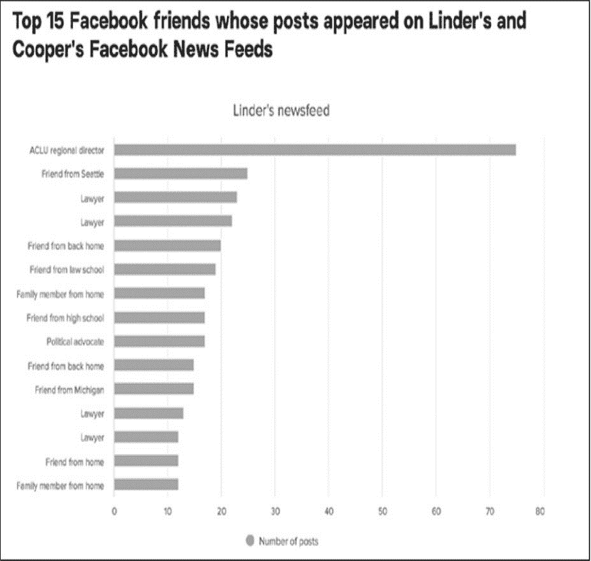
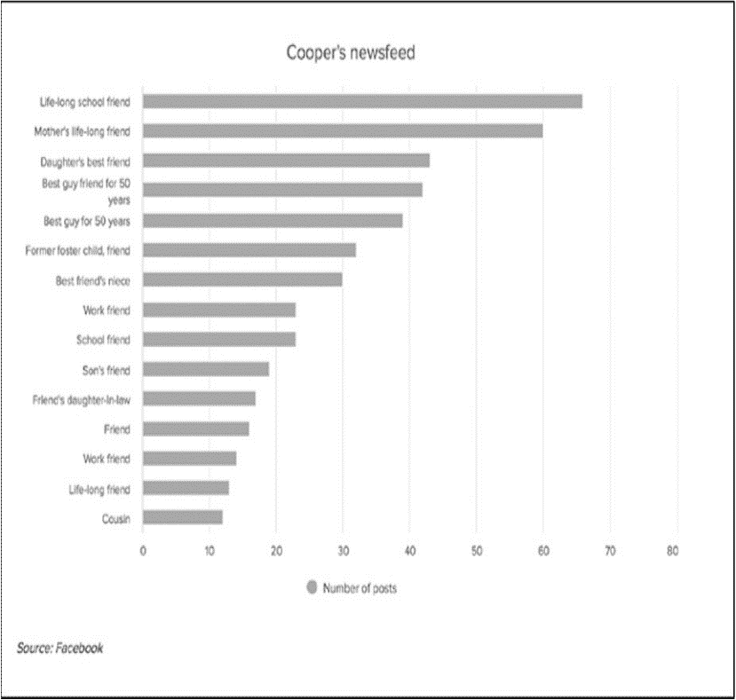
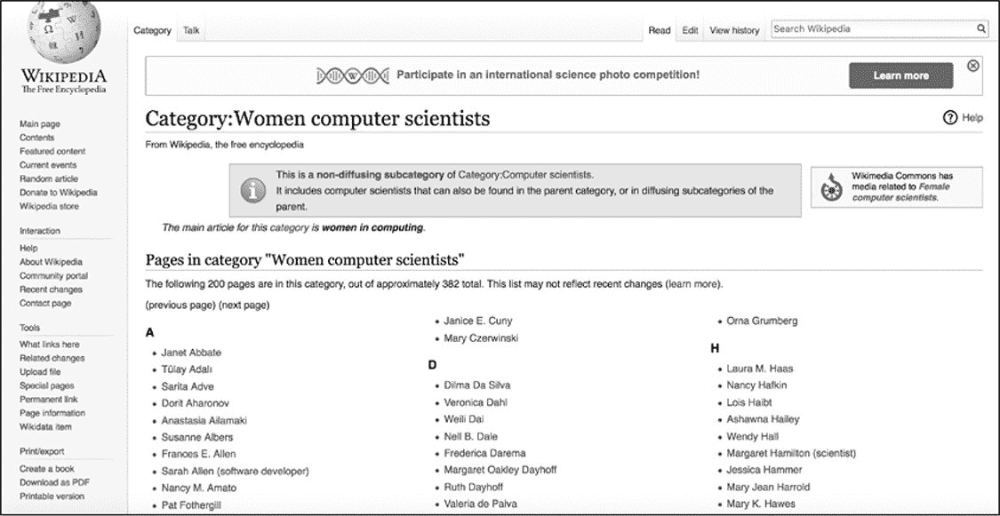
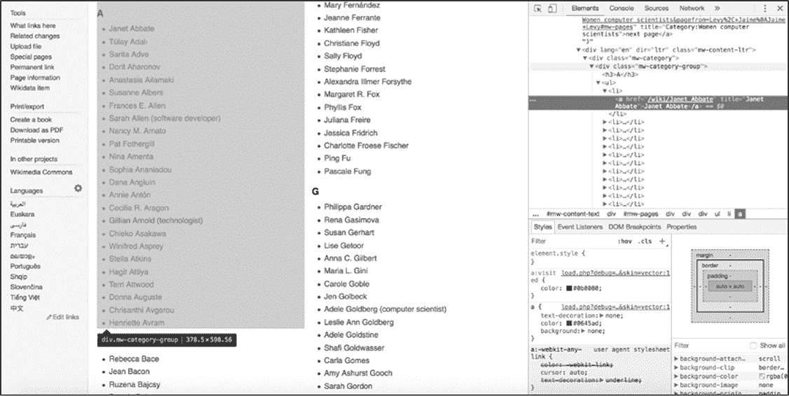
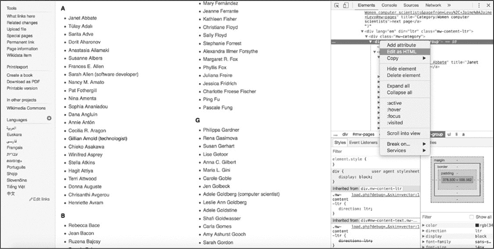
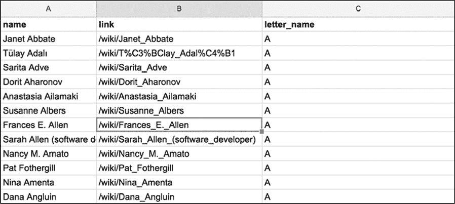

# 5 抓取实时站点
-------------------------------------------------------------------------------------

从数据侦探的角度来看，每个在线内容都是要收集的信息宝库。联想一下一系列的Tumblr帖子，或在Yelp上列出的商家评论。在每一天中，使用在线帐户的人都会产生越来越多的数据，这些数据显示在网站和应用程序上。因此，**一切都是数据，正等待结构化**。

上一章中讨论了如何通过网络页面抓取数据，或使用HTML元素的标记和属性从中提取数据。在本章中我们从Facebook下载的数据文件中提取数据。

#### 凌乱的数据

网站是为使用它们的人而创建的，而不是为想要挖掘其数据的人而创建的。因此，许多网站具有使消费者更易于阅读和使用它们的功能，但对于数据侦查目的而言不是理想的选择。

例如，Facebook帖子中有4532个反馈，可能会显示**4.5K**反馈的缩写标签。而且，Facebook经常不显示完整的时间戳和数据，而是仅显示帖子创建前几个小时的数据。尤其是在社交媒体平台上，通常会优化在线内容以使其有用和有趣，但不一定具有完整的信息。

就我们的目的而言，这意味着收集的数据可能是不规则，凌乱的，甚至可能是不完整的。这也意味着需要寻找一些方法来处理网站的结构才能获取信息。

您可能想知道为什么在可能有API的情况下，要花这么多精力来获取数据？在某些情况下，无法通过API提供在实时网站上易于访问的数据。例如，Twitter允许在滚动源时查看三个月的数据，但仅允许通过API访问大约3200条推文。在Facebook上，可以通过API获得与公共团体和页面相关的数据，但可能与填充新闻推送的数据不同。

在BuzzFeed的一篇报道中，分析了凯瑟琳•库珀(Katherine
Cooper)和林赛•林德(Lindsey
Linder)在Facebook上发布的2367条新闻，展示了他们的网络世界有多么不同。库珀和林德说：在Facebook上，他们的政治分歧导致了激烈且丑陋的争吵，这在线下交谈时不会发生。查看各自的推送有助于理解每个女人的信息世界是由其帖子出现频率最高的人塑造的(见图5-1)。

这些信息是为每个Facebook账户量身定制的，意识是说只能通过查看Linder和Cooper的Facebook新闻推送才能获得。

   

*图5-1：Linder和Cooper的feeds上显示最多的帖子*

#### 数据抓取的伦理考虑

社交媒体公司根据他们认为合适的商业利益、用户隐私问题和其他原因来设置数据限制。在某种程度上，抓取是绕过这些限制的一种方法。

然而，不应轻率地决定是否要抓取一个网站。在未经允许的情况下从网站上抓取信息或重新发布被抓取的数据可能违反了公司的服务条款，并可能导致被禁止登录该平台，更严重的情况是可能导致法律诉讼。

那么什么时候可以从网站获取数据呢?

从实时站点抓取数据的决定以及如何构造Web抓取工具都需要考虑多种因素。数据记者罗伯托·罗查（Roberto
Rocha）在他的博客文章"关于网络爬虫的道德"（https://robertorocha.info/on-theethethics-of-web-scraping/）中列出了四个可以作为良好指导原则的问题：

> 1\. 能拿到这些数据吗?
>
> 2\. 可以重新发布这些数据吗?
>
> 3\. 是否超载网站的服务器?
>
> 4\. 能用这些数据做什么?

当然我们不是第一个，也不会是最后一个有兴趣从网站上搜集信息的人。考虑这种情况，社交媒体公司可能会制定相关政策，这些政策通常以两份文件的形式发布：

● 机器人排除协议（译者注：通常包含在网站的robots.txt文件中）

● 服务条款

接下来，从robots.txt文件开始，深入研究这两个政策。

###### 机器人排除协议

机器人排除协议是一个文本文件，通常托管在平台的服务器上。可以通过输入网站的网址（例如http://facebook.com/），然后将robots.txt附加到末尾来找到该文件，例如：<http://facebook.com/robots.txt>。

许多网站和平台的所有者使用此文档来处理web机器人（以自动方式浏览web的程序和脚本），更简单地说不是人类在浏览网站信息。这些机器人通常也被称为"爬虫"、"蜘蛛"，或者一个更有诗意的词"网络漫游者"。机器人排除协议文件以标准化的方式构造，基本上就像web机器人试图访问网站的规则一样。

在现实中不是所有的抓取工具都遵守这些规则。垃圾邮件机器人或恶意软件可能会无视该协议，但这样做会冒着被从平台上踢出的风险。确保我们尊重每个网站的规则，这样就不会被踢出了。

一个基本的*robots.txt*文件如下所示：

其结构如下：

术语User-agent是指定规则适用于谁。在示例中的user-agent是\*，这意味着该规则适用于任何机器人。Disallow意味着机器人不能抓取列出的目录或文件夹。在本例中，正斜杠(/)指定机器人不能抓取网站根文件夹中的任何内容。根文件夹包含网站的所有文件，意思是说这个robots.txt文件禁止所有机器人抓取网站的任何部分。

这并表示不可能从该站点获取数据。仅仅说明该站点不支持抓取，如果抓取可能会给站点的所有者带来麻烦。

robots.txt文件也可以有更详细的规则。例如：Facebook的robots.txt文件包含专门适用于名为Googlebot的User-agent的从句(见清单5-1)。

*清单5-1：Facebook更复杂的robots.txt*

该文件为Googlebot的机器人不允许访问Facebook网站的任何部分，包括URL的facebook.com/ajax/、facebook.com/album.php、facebook.com/checkpoint/等。

###### 使用条款

网站的使用条款文件可以查明网站所有者是否允许机器人抓取他们的网站。使用条款可能会指定允许web机器人做什么，或者如何重用来自网站的信息。

社交媒体用户生成的数据对提供这些在线服务的公司非常有价值。我们的共享行为、浏览和搜索历史记录允许平台为用户建立数据配置文件并推销产品。多数社交媒体公司都有明确的经济动机，从而不允许其别人收集这些数据。

社交媒体公司还必须保护用户的数据和隐私。如果垃圾邮件机器人或其他有问题的机器人收集用户信息，可能会离间平台与用户，导致用户远离公司所提供的服务。出于这两个原因，以及其他各种原因，社交媒体公司非常重视它们的使用条款。

#### 数据抓取的技术考虑

除了web抓取的道德考虑之外，还有一些技术因素需要斟酌。在前一章中，从下载到本地机器的web归档文件中提取数据。表明没有使用我们的脚本连接到互联网，也就没有访问实时网站。

使用抓取工具打开一个网站后，就应该考虑会对承载内容的服务器造成哪些影响。每次打开一个网站，都是在访问服务器上的信息。每个请求都需要网站的脚本来获取数据：将数据转换成HTML格式，然后传输到浏览器。每一步动作都要花钱（就像在手机上传输几兆字节的信息要花我们的钱一样）。

在浏览器中打开一个网站，等待它加载，然后像人类用户那样滚动是一种情况。让一个机器人在几秒钟内打开1000个网站是另一回事。可以联想一下，一个服务器必须同时处理上千次这样的传输。可能会在这些请求的速度和权重下崩溃---换句话说，服务器将超载。

这也表明，当完成一个抓取工具或机器人，应该放慢其运行速度，指示其每次打开页面后等待几秒钟再打开另一个页面。在本章后面编写抓取工具时，您会看到如何实现这一点。

#### 抓取数据的原因

最后但并非最终，思考需要信息的理由对于我们的抓取过程非常有帮助。没有可靠的方法可以避免与拥有和运营平台的公司、希望搜集的网站以及人们发布的内容发生冲突，但如果决定请求社交媒体公司允许从他们的网站中获取数据，或者决定自己承担风险，那么应该确定是否有周密考虑过的理由。

对搜集信息的原因有透明且清晰的认识可以帮助社交媒体公司决定是否允许你继续。例如，为科学项目研究社交媒体上的数据是一个很好的理由，而出于商业目的抓取社交媒体的数据则可能因其行为而面临法律后果。有很多因素会影响到法律对信息抓取行为的规定，位置、公司或组织的位置、发布内容的版权、抓取的平台的服务条款、数据收集可能引发的隐私问题------所有这些都必须是你想搜集信息时决策过程中的一部分。每一个数据收集的案例都是不尽相同的，在开始编写代码之前应该确保完成了法律和伦理的研究。

记住这些道德和技术上的考虑，现在开始从一个实时网站抓取数据。

#### 从实时网站抓取数据

在本例中，将从维基百科中获取一份女性计算机科学家的列表，维基百科中有一个robots.txt文件，允许良性的机器人获取其内容。

如图5-2所示，被抓取页面的URL为https://en.wikipedia.org/wiki/Category:Women_computer_scie
ntists。

 

*图5-2：维基百科（Wikipedia）的女性计算机科学家名单*

如同在前几章中所做的，通过加载所需的库开始编写脚本。打开文本编辑器（译者注：或者已经习惯的IDE），然后将新文件wikipediascraper.py保存至一个文件夹中。接着将清单5-2中的代码输入到该文件中。

*清单5-2：设置脚本*

在脚本中导入了在前几章中使用过的csv、requests和beautifulsoup4库。之后的代码与之前的脚本相同：为rows分配一个空列表值，并在稍后将向其添加至其中。

接下来就应该打开一个在线网站了。这个过程与第2章中通过URL打开API推送时所做的非常相似，但是这次是打开包含想要获取信息的维基百科页面。把清单5-3中的代码输入到Python文件中。

*清单5-3：从URL检索内容*

第一个变量url➊，一个字符串，其包含想打开的URL地址。接着是变量page➋，使用requests库的get()函数获取web站点。之后，使用content➌属性从page中获取web站点的HTML内容。最后使用Beautiful
Soup的HTML解析器来解析HTML内容。

###### 解析页面内容

如同处理Facebook档案中的HTML页面一样，需要分析包含希望通过Python脚本获得的内容的HTML标记。

 与前一章中相同，使用Web检查器，检查器能够隔离相关代码。在本例中，通过Web检查器找到一个由维基百科作者和编辑组成的女性计算机科学家列表，如图5-3所示。

*图5-3：通过浏览器进入想要抓取的维基百科页面，打开Web检查器*

如上图所示，计算机科学家的名字被细分为按字母顺序显示的姓氏排序的列表。在浏览器中该列表被扩展到两个web页中。可以通过单击next
page链接访问第二个页面。

要显示哪些元素包含想要抓取的内容，可以右键单击列表中要抓取的名称，然后在web检查器中查看相应的HTML代码。同时可以检查在收集数据时可利用的模式。

右键单击"A"组中的一个名称，并在下拉菜单中选择"Inspect"选项。这样会改变Web检查器内部的视图：HTML视图应该跳转到选择的"A"组中包含名称的代码部分，并突出显示包含名称的标记。网站代码可能很长，其包含数百个HTML标记，Inspect可以在网站的HTML页面中找到在页面上看到的特定元素。如果不能理解Chrome的web检查器的话，可以把它想象成在地图上的"在这里"标记。

找到了"A"组中的一个名称在HTML中的位置后，就可以开始检查包含"A"组中所有其他名称的HTML标记结构了。通过滚动代码到父\<div\>标记\
，选中该标记后在web页面就会突出显示相应部分（图5-4所示），该标签保存以"A"开头的姓氏列表。

 

*图5-4：突出显示字母"A"下的女性计算机科学家列表的父标记*

右键单击父标记并选择Edit as
HTML，就可以复制和粘贴父标记以及嵌套在父标记内部的每个HTML标记（图5-5所示）。

 

*图5-5：选择Edit as HTML*

把刚刚复制的代码粘贴到文本编辑器中的空文件中，这些代码应该与清单5-4中显示的内容相同。

*清单5-4：没有缩进的维基百科 HTML*

从这些HTML代码中可以看到，网站上的HTML代码通常很少或没有缩进或空格。这是因为浏览器从上到下、从左到右读取每行代码。不同代码行之间的空格越少，浏览器读取它们的速度就越快。

然而，这种简化的代码比缩进的代码更难让人阅读。使用空格和制表符允许程序员指示代码不同部分中的层次结构和嵌套。由于大多数web页面为了迎合浏览器而消减或最小化代码，所以有时需要对其进行反向操作。若代码是缩进的，那么就能够更容易阅读和理解包含所需信息的HTML元素的层次结构和模式了。

网路上有许多免费工具可在HTML代码中重新引入缩进和空格，包括Unminify（http://unminify.com/）。只需要复制缩小的HTML，将其粘贴到该工具提供的窗口中，然后单击按钮即可（见清单5-5）。

*清单5-5：带有缩进的维基百科代码*

如清单5-5中所示，HTML页面内容包含类mw-category-group➊的父\<div\>标记，在\<h3\>➋标记内包含字母表中的字母，在\<ul\>➌标记包含无序列表，\<li\>➍标记包含所有姓氏以\<h3\>标题中指定的字母开头的女性（在本例中为A）。还存在指向每个女性的维基百科页面链接名称的\<li\>标记➎。

###### 把页面内容存储在变量中

根据对以上HTML代码的了解，回顾一下打开页面后需要做的事情：

1\. 从第一页中获取所有无序的名称列表。

2\.
从每个列表项中提取信息，包括女计算机科学家的姓名以及她的个人资料的链接和她所属的字母。

3\. 基于此信息创建一行数据，并将每一行写入csv文件。

 图5-6中的表格是根据这些说明来构造数据样子。

*图5-6：可以帮助我们构建抓取工具的表格模型*

> 我们用脚本依据字母表抓取，回到Python脚本文件中，并输入清单5-6中的代码：

*清单5-6：使用Beautiful Soup检索HTML代码*

在这段代码中，使用find()➊函数查找包含类mw-category的\<div\>标记。这是包含想要抓取的全部内容的\<div\>标记（与在前面通过Web检查器查看页面时看到一样）。将该值（即包含所有列表的整个HTML块）分配给变量content。下一行将包含类mw-category-group➋的所有\<div\>标记放入变量all_groupings中。此处使用函数find_all()来完成，该函数根据指定的特性在HTML中搜索元素，并创建搜索到的全部元素的列表。给find_all()函数传递两个参数：字符串"div"，
希望find_all()找到什么类型的HTML元素；以及类参数"mw-category
group"。这就是说让find_all()函数获取具有类"mw category
group"的每个\<div\>，并创建搜索到的列表。变量all_groupings会包含一个HTML元素列表，其中含有按字母顺序排序的名称列表，以及每个妇女姓氏的第一个字母。

接下来就可以按字母顺序遍历每个列表，并从每个列表中收集名称。把清单5-7的代码输入到Python文件中。

*清单5-7：使用for循环收集每个名称*

第一步编写一个for循环➊，用来遍历刚添加到变量all_groupings中的每个分组。然后，使用grouping.find()函数收集无序列表标记\<ul\>➋中的内容，并将所有收集到的内容放入变量names_list中。接下来，我们再次使用grouping.find()函数收集标题标记\<h3\>➌的内容。代码grouping.find（"h3"）包含所有标记\<h3\>，但对于csv文件只需要与每个标题关联的文本，使用get_text()函数提取属于每个组的内容。最后但并非最终，获取\<ul\>无序列表中的每个列表项标记\<li\>。由于把所有\<ul\>分组存储在names_list中，因此可以直接在变量names_list➍上直接使用find_all()函数。至此完成获取字母和所有相关名称列表的操作了。

脚本的最后一步是创建一行信息，其中包含名称、链接和连接到每个名称的字母（清单5-8）。

*清单5-8：把每个名称的信息分配给变量，创建写入csv文件的行数据*

脚本中的代码开始变得有些复杂了：在一个循环中嵌入另一个循环。首先，必须循环浏览每个字母表。清单5-8中的代码中是在清单5-7的循环中编写另一个for循环➊。在清单5-8的嵌套循环中，循环遍历存储在当前变量alphabetical_names中的列表项标记\<li\>中的每个字母名称。

每个\<li\>列表项标记都包含一个名称，使用属性text➋提取该名称。此列表项还包含链接，使用其他两个功能来获取这些链接。使用find()函数➌获取锚标记\<a\>。find()函数有两个参数：第一个参数是想要查找的标记（对于锚标记是一个"a"）；第二个参数是可选的，表面不必总是向其传递参数。可选参数具有默认值，可以在需要时更改。在这种情况下，可选参数是href，默认情况下通常将其设置为值False。通过设置href
=
True➌告诉函数仅在标记具有href属性或链接的情况下才获取锚标记。如果不传递可选参数，则find()函数将默认获取每个锚标记。

将检索到的锚标记存储在变量anchortag内，该变量现在会包含检索到的锚标记中的所有信息。通过访问锚标记的href值获取标记内的链接信息，该值是作为属性存储在标记内。使用包含字符串"href"➍的方括号来获取href属性。然后创建一个字典来构造收集到的数据（清单5-9）。

*清单5-9：创建一个字典存储数据*

每次for循环迭代时都会创建一行数据。在代码的第一行中，使用在第➊行中打开并在第➌行中关闭的大括号为变量row分配一个字典。然后在字典内为每个键（name➊，link➋和letter_name➌）分配一个值，这些值保存了在先前脚本中收集到的数据。最后把数据行附加到列表变量rows➍中。

到目前为止，您编写的脚本应类似于清单5-10。

*清单5-10：编写的整个脚本*

如果只想从一个页面收集数据，那么这个脚本就可以完成想要的任务了，但是如果需要从几十个甚至几百个页面收集数据，那么该脚本就达不到要求了。还记得之前一直强调：应该编写可重用代码吗？在本练习中终于有了一个用例！

###### 使脚本可重复使用

现在有了一个脚本，这个脚本可以在一个页面上抓取每位女性计算机科学家的名字。但是这个页面只包含想要抓取名字的一半内容，因为女性计算机科学家有很多，维基百科不得不把这个列表分成两个网页。

若要获得完整的列表，需要从下一页获取其余的名称。通过将刚刚编写的所有代码包装成一个可以重用的函数来实现这一点（清单5-11）。

*清单5-11：将脚本放入函数中进行重用*

要在脚本文件中重新生成清单5-11，首先要从当前脚本中删除以下代码：

因为需要在多个url上运行代码，所以不再需要单独为url变量赋值。

接下来让Python创建一个名为scrape_content()➊的函数，其参数是url。然后之前的代码➋组成scrape_content()函数。scrape_content()函数中的所有代码都与清单5-10中的代码相同，只是现在这些代码缩进的在函数内。(如果使用的代码编辑器没有对代码进行自动缩进，可以使用TAB键进行缩进。)在➋中可以看到使用requests.get
()打开一个了url，此处的变量url是指在定义函数中制定的参数url➊。

简单地说只是给Python提供了一个用于在调用函数scrape_content(url)时需要执行操作的指令手册。用一个实际的url替换url参数，然后脚本就能打开该url并进行抓去。例如，要在维基百科页面上运行该函数，只需在脚本中添加以下行：

然而，需要多次运行这个函数。如果仅仅在一个或两个url上运行该函数，那么就没有很大的问题，但需要在数百个url上运行它，那么需要稍微修改一下脚本代码。可以通过创建一个包含多个URL字符串的列表来实现，这样就可以遍历这个列表，然后为每个链接运行函数。为此，在清单5-11的代码之后将清单5-12中的代码添加到脚本中。

*清单5-12：使用循环在URL列表上运行该函数*

变量urls➊是一个容纳两个字符串的列表：第一个是含有上半部分女性科学家名字的维基百科页面url；第二个url链接保存剩下的名字。然后编写一个for循环，通过对每个在urls➋中的url运行scrape_content()函数➌抓取数据。如果想在更多的维基百科列表页面上运行抓取工具，只需将这些页面作为添加到列表urls即可。

至此已经将所有数据放入了变量rows中了，是时候把数据转换为电子表格输出了。要实现这个要求，只需把清单5-13中的代码行添加到脚本中。

*清单5-13：从收集的数据创建csv文件*

之前,使用open()函数打开csvfile➊语句来创建和打开一个文件名为all-women-computer-scientists.csv的csv文件。因为之前来收集数据是使用的是字典，因此需要指定表格的标题名称列表➋,然后使用csv库的DictWriter()函数➌生成writer，最之后采用writer的writeheader()方法➍向第一行写csv文件的列标题。

最后，只需要遍历rows➎中的每一行，然后把每一行写入表格中writer.writerow()➏。

###### 练习文明的抓取方式

至此已经完成了编写一个能够有效收集数据的工作脚本。但是有两件事应该考虑添加到这个脚本中：第一使抓取工作透明清晰；第二避免承载数据的服务器超载。

首先，为抓取攻击提供详细的联系方式。如果出现任何问题，正在被抓取网站的所有者可以联系你。在某些情况下，如果抓取工具正在造成麻烦，你的PC会被从该网站上踢下来。如果网站所有者能够联系到你，并告诉你调整你的抓取工具，那么就能够继续在哪个网站上的数据抓取工作。

第二，在脚本中导入的库requests附带了一个有用的参数headers，可以在使用requests访问web页面时调整这个参数。该参数接收一个Python字典作为输入，该字典用于保存对于网站所有者来说很重要的信息。将清单5-14中的代码添加到脚本中，同时用您自己的信息替换作者的信息。

*清单5-14：在脚本中添加header参数*

清单5-14中的代码必须放在脚本的导入运行库之后，因为需要加载requests库才能用到。由于headers是预设置的变量，并且不会在脚本运行时更改，所以可以将headers放在靠近脚本顶部的位置，最好就在导入库的代码之后。用还有headers参数的语句page
= requests.get(url, headers=headers)替换原代码page =
requests.get(url)。这样每次你想要对某个网址进行数据抓取时就能够提示网站所有者（或管理者）您的信息。

分配给headers变量的信息是通过脚本打开URL时与服务器交换的信息。正如您看到的，所有这些信息再次以JSON的形式构造（也可以说是Python的字典格式），这些字符串分别表示键（"user-agent"，"
from"）和值（"Mozilla/5.0 (Macintosh; Intel Mac OS X 10_12_6)
AppleWebKit/537.36 (KHTML, like Gecko) Chrome/65.0.3325.162
Safari/537.36","Your name <example@domain.com>"）。

首先，向网站所有者提供有关正在使用的用户代理(user-agent)类型的信息。虽然对于机器人来说该信息不是必要的，但可能会使抓取工具打开通常无法在网络浏览器之外打开的网站。抓取工具还可以使用计算机已经安装的其他浏览器来访问网站。用户代理报头(user-agent
header)可以传递抓取工具用于在浏览器中打开页面时浏览器功能的信息（在此示例中，没有进行这样的操作，但这对于编写其他机器人是一种有用的习惯）。要了解还使用了哪些其他用户代理，可以在网上找到各种在线工具，包括此处的一种：[*[https://www.whoishostingthis.com/tools/user-agent/]{.ul}*](https://www.whoishostingthis.com/tools/user-agent/)。

然后指定键from➋的值内容，可以把您的姓名和电子邮件地址当作联系信息写入其中。最后就是在requests.get()使用这个头文件参数➌。

最后但并非最终，还应该避免让承载正在被抓取网站的服务器负担过重。这种情况经常发生在抓取工具连续快速打开多个页面时，其原因是没有在每个请求之间暂停一下。

为此，使用一个名为time的库（属于Python的标准库），该库能够实现脚本运行时进行暂停的功能。将清单5-15中的代码添加到脚本中。

*清单5-15：在脚本的代码中添加暂停*

使用time库之前,先要把库导入➊。然后使用time库中的sleep()函数➋，这样就可以实现让抓取工具实现暂停的功能。sleep()函数接受一个数字（表示中断的时间，以秒为单位）作为参数，该数字可以是整数，也可以是浮点数➋。在示例的脚本代码中是指示其等待2秒后再抓取数据。

将本章的所有代码片段拼接在一起，这个脚本应该如清单5-16所示。

*清单5-16：完整的抓取脚本*

保存完整的抓取脚本后，再运行和测试该脚本之前，请确保计算机已连接了互联网。打开命令行接口，在其中切换至包含该该脚本的文件夹，然后根据所使用的Python版本在命令行接口中运行以下命令之一。在Mac上，使用以下命令：

在Windows机器上，请运行一下代码：

抓取脚本运行完成后会在包含wikipediascraper.py文件的文件夹中生成一个csv文件。

#### 概要

总而言之，本章中的实践不仅让读者体验到了抓取的力量，也提醒了抓取行为可能产生的道德后果。**仅仅因为你有能力做某事并不意味着你可以随心所欲地去做。**阅读本章之后，读者应该掌握了***负责任***地收集数据所需的所有知识。

