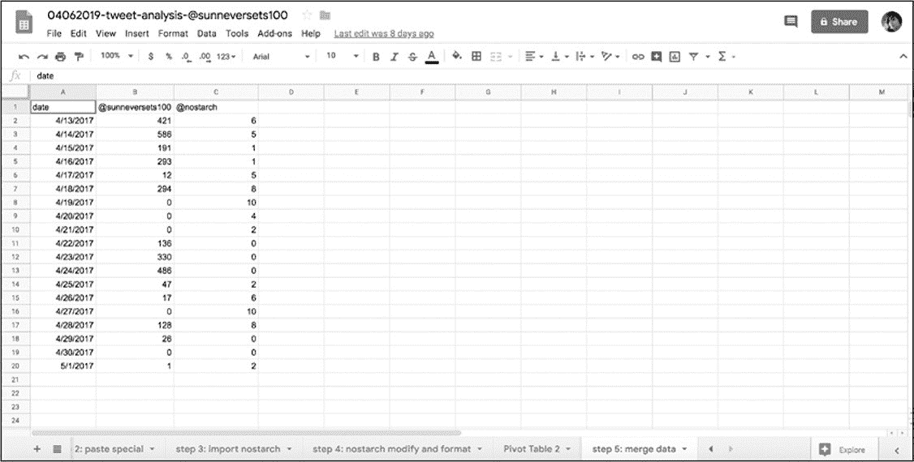
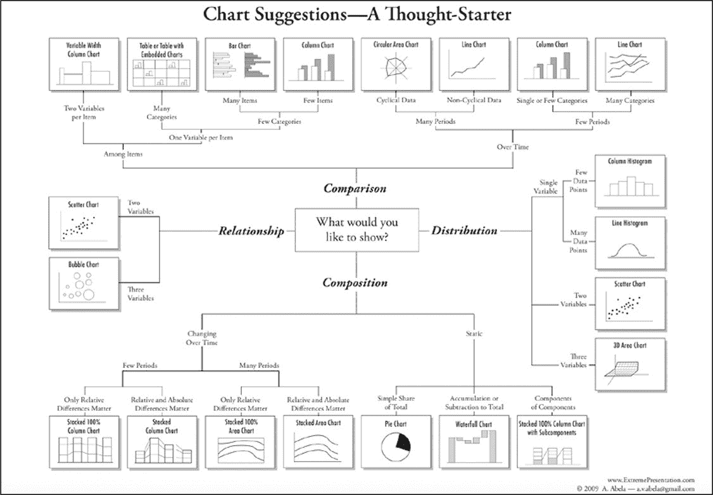
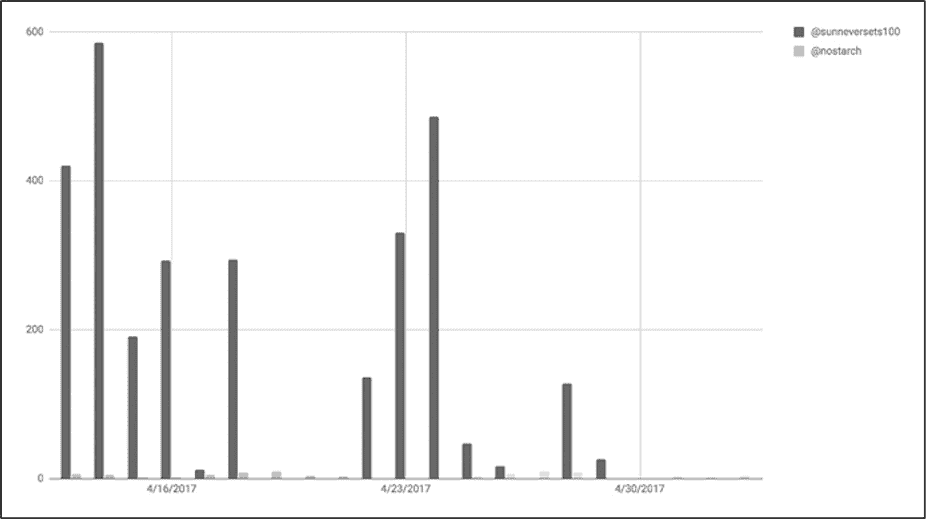
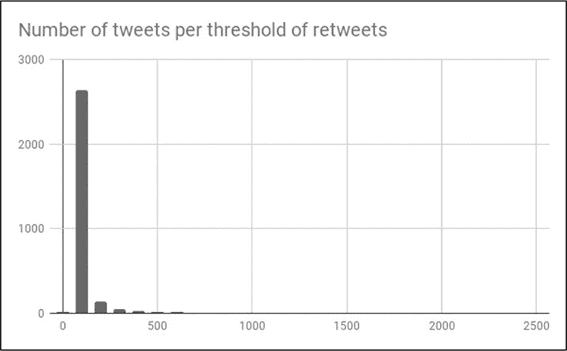
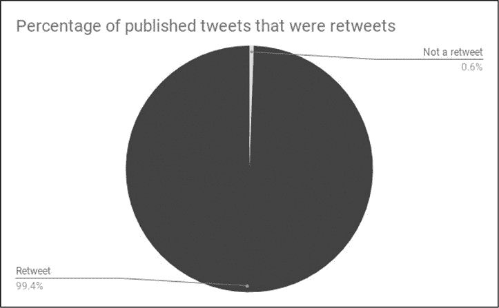
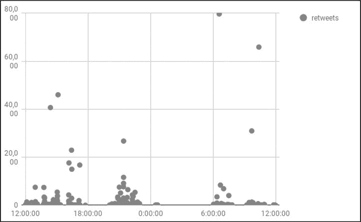
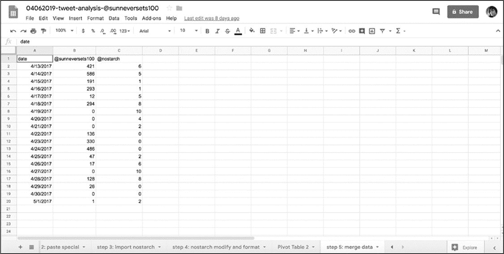
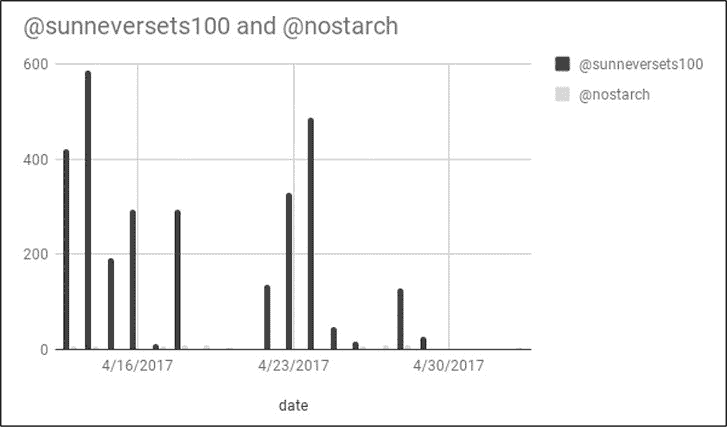
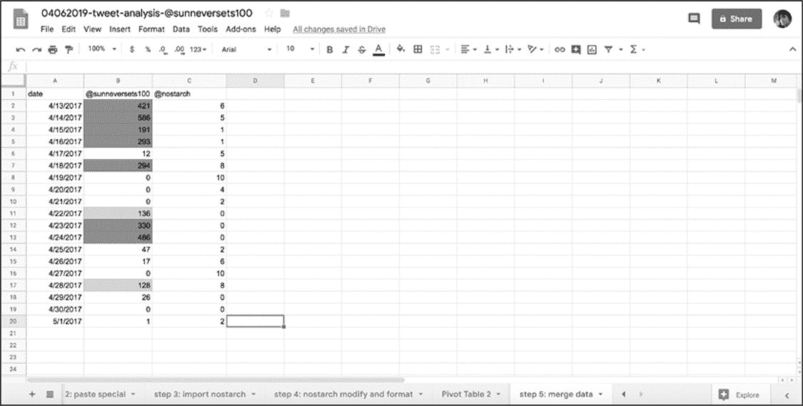
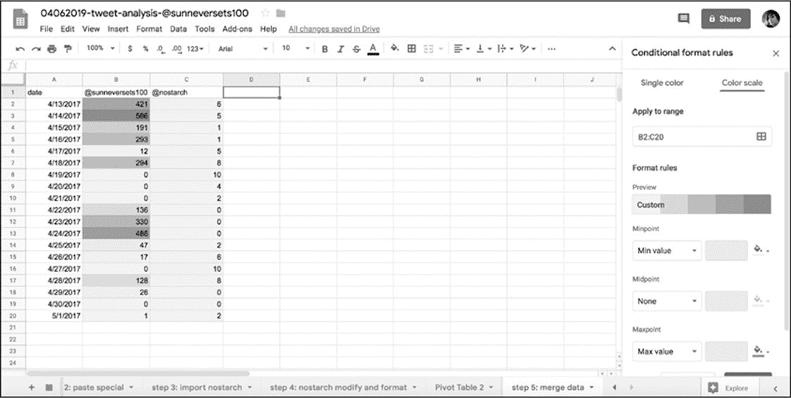

# 7 数据可视化
--------------------------------------------------------------------------------------------------

到目前为止，已经学习了如何从社交媒体收集、加工和处理数据。数据分析的下一步是运用可视化来更好地理解发现。

可视化是即刻理解数据的最有有效方法。例如，图表可以帮助我们了解数据随时间的变化，用颜色编码的电子表格可以清楚地显示数据集中各个数据值的范围。

在这一章中将要讨论如何对前一章分析的Twitter机器人数据使用可视化，在Google
Sheets中使用图表和条件格式工具来更深入地了解这些数据。

#### 通过图表了解机器人账户

在第6章中，使用了数字取证研究实验室开发的一个标准来确定Twitter的\@sunneversets100账户是否是一个自动的"机器人"账户。再次回顾一下实验室的标准：每天发72次以上推特的可能是机器人，而每天发144次以上推特的可以确认是机器人。在前一章中获取的数据中发现有很多天\@sunneversets100账户发送的推文比这两个标准都要多的多。

 在第6章的结尾，还把机器人的行为与正常人的进行比较（图7-1）。

*图7-1：比较可疑的机器人账户和人控账户每日推文频率的表格*

该表格清楚地显示：\@sunneversets100账户每日推文的数量远远超过用于比较的人控账户。但是，仅通过阅读推文或查看该表格中的值不能直观的感受这一情况。这就是图表等数据可视化工具可以提供帮助的地方。

#### 选择图表

图表以及数据驱动的图形可以让人即刻理解更多所展示数据代表的故事。可以使用形状(例如，圆形、矩形或直线)和颜色来比较值，也包括这些值是如何随时间变化的。可视化可以帮助受众一眼看到模式或关键发现。

但是在使用可视化之前，应了解图表具有不同的类型。一些图表主要是在统计学家或数据处理人员的圈子里使用，而另一些是普通大众熟悉的。重要的是：任何给定的图表都可能非常有效地传递一种类型的数据，但完全不能传递另一种类型的数据。由于这个原因，需要考虑使用图表来展示什么内容？好像前面讲的，数据分析有点像面试。确定每个问题的答案需要一组稍微不同的工具，对数据集提出问题可以帮助我们确定使用哪种图表来查找答案。

 选择正确的图表有时候很困难，但学者和图形编辑已经开发了许多指南。其中一个是："Chart
Suggestions---A
Thought-Starter"，里面是一些最常见的数据可视化图形的对比（图7-2）。

*图7-2：Andrew Abela开发的指南*

接下来讨论不同的图表类型及其用法。第一个是对不同的数据集进行比较，如：在上一章的分析中，比较了两个数据集：机器人和人类。

 常见用于比较数据的图是柱状图（图7-3），该图绘制了在图7-1中的数据。

*图7-3：用于比较机器人和人类活动的柱状图*

除了使用图表来比较各个数据点，还可以用图表来展示数据集的分布情况或值的范围。例如，把整个数据集划分为多个区（例如年龄段或等级A到A--、B+到B--等），然后计算每个区中有多少数量或占总体的百分比。

例如，在\@sunneversets100数据中可以查看每个推文被转发的分布情况。在图6-3所示的原始数据表格中，能够看到推文被转发数值的范围从0到1-100、101-200、201-300。

 把图7-2中的流程图作为参考，发现对于像类似小分布的数据可以使用简单柱状图（图7-4）。

*图7-4：每个推文转发数量的分布*

有时想要了解整个数据集的构成，而不考虑年龄范围或转发数量等细分。可能只想看看数据集的构成，那么可以使用图表来理解数据集的部分与整体之间的关系。在图7-4中，可以看到大多数推文都有1至100次的转发，表明这些机器人吸引推文方面可能有些有效效果，但不是非常明显。

 机器人经常被用来放大别人的信息，也就说明机器人不会发布太多原创内容。介于这个原因查看\@sunneversets100账户的推文被转发的比例就会感到很有趣。图7-5的饼图展示了\@sunneversets100账户的推文中有99.4%被转发。

*图7-5：饼图和环状图非常适合显示整体中类别的比例*

最后但并非最终，使用图表展示数据类别可以呈现不同的关系。例如，询问一个值如何与另一个值关联，并研究一个列值的行为特征是否会导致另一个列值的减少或增加，或者一个列值是否与另一个列值的行为相关，这些关系都可以通过图表说明。

尝试理解一条推文被发送的时间和它被转发的次数之间的关系。在一天中一篇推文在转发参与度方面表现得是否特别好？确定这种关系最合适的图形是散点图，散点图是每个数据点沿着x轴和y轴放置的图形。

 通常，研究人员感兴趣的是测量一个因变量或数据集如何受到一个无法控制的自变量或数据集的影响（比如降雨），这些因变量或数据集可能会由于外部因素而改变（雨伞的销售情况）。在某项研究中，研究人员想要找出降雨对雨伞销量的影响时，就可以使用散点图来观察两者之间的关系。散点图的惯例：自变量放在x轴上，因变量放在y轴上。同样的，给Tweet的推文数据提出如下问题：一天各个时间断对一条推文被转发的次数的有何影响？图7-6展示了一个图表，该图表给出了此问题的数据呈现。

*图7-6：一天的时间内\@sunneversets100被转发推文的散点图*

#### 时间序列的具体说明

在开始制作图表之前需要认识的最后一个方面就是使用数据集的时间序列。对数据集提出的问题通常要求指定一个特定的时间点或更长的时间段。要绘制时间序列的图表，必须把数据按照时间聚合为小块，例如：推文的时间戳，或者更小的时间单位(如一个月或一年)。

在前一章中，使用数据透视表记录了\@sunneversets100和\@nostarch的每日推文，从而为图表创建了一个时间序列。然后，根据两个数据集共有的时间范围使之合并。这就可以把两个账户放在一起并排对比了。

至此已经学习了选择正确数据可视化的方法，现在看看如何在Google
Sheets中制作这些图表。

#### 制作图表

制作一个图表的一般步骤如下：

> 1\. 提出一个问题。
>
> 2\. 进行数据分析来回答这个问题。
>
> 3\. 选择最好的图表格式和工具来回答的问题。
>
> 4\. 以所选图表工具能够理解的方式格式化和安排数据。
>
> 5\. 插入或选择数据，然后使用工具创建图表。

与Microsoft Excel一样，Google
Sheets提供了一套有用的绘图工具，可以直接在电子表格中添加快速图形。为了使这个练习简单，使用上一章中的数据制作一个图表。现在按照列出的步骤进行图表的制作过程。

通过分析试图回答的核心问题是：机器人的行为如何与人类的行为相比较？为回答这个问题所做的分析得出了一个大致三星期的时间序列。这就完成了步骤1和步骤2。

接下来是选择最佳的图表进行分析。正在尝试比较的是两个数据集------机器人和人类的日常推文活动------并且想要按照时间显示这种比较。图7-2中的流程图建议使用柱状图。

然后就是格式化数据。正如在上一章中讨论的，处理数据(无论是Google
Sheets还是python)的一个核心部分弄清楚是每个电子表格列包含的数据类型并将其格式化。此步骤有助于工具和编程语言正确解释数据。

 在柱状图中沿着x轴绘制时间值，并沿着y轴绘制数值(每个帐户每天发出的推文数量)。因此，应该确保Google
Sheets在一列中接收日期的值，在另外两列中接收数字的值（图7-7）。

*图7-7：包含了绘制随时间变化所需所有值的表格*

运用在第6章所学到的知识，选择含有日期的列数据，然后选择**Format ▸ Number
▸
Date**来格式化这些数据成为日期型数据。选择含有账户活动记录的列，然后选择**Format
▸ Number ▸ Number**把它们格式化为数值型数据。

下一步中需要选择使用哪种图表来绘制数据的图形。与之前一样，确保选择了所有要在图形中呈现的数据。选中含有日期和记录的数据列-然后选择**Insert**
▸ **Chart**。

 完成上述操作后Google
Sheets会把一个图表直接插入到表格中（图7-8），同时会打开一个称为图表编辑器（*Chart
Editor*）的窗口。

*图7-8：显示机器人和人类大约三周的Twitter活动的图表*

该图表编辑器可以让我们修改图表，其由两个选项卡组成：数据Data和自定义Customize。在Data选项卡中，可以调整或修改图表的内容，如：选择用来制作图表的单元格的范围、设置某一行中的值为图表标题。在本练习中，在**Chart
type**下拉菜单中选择**Column chart**（柱状图）。

在图表编辑器的自定义选项卡中，可以风格化我图表，例如：更改图表的标题、设置坐标轴的最小值或最大值、为图表文本选择不同的字体。现在使用选择菜单项**Series**更改表示机器人数据的颜色。通过鼠标的点击会展开一个下拉菜单，其中包含绘制的两个数据系列------机器人数据和人类数据。每个数据系列通常以列标题命名。在本练习中选择\@sunneversets100并使用桶（bucket）图标下的调色板（color
palette）更改该列的颜色。

最后但并非最终，通过单击图表右上角的三个点并选择"**Move to own
sheet...**"选项把刚刚生成的图表移动到属于它自己的工作表上。在用图表呈现数据时数据集的细微差别在更大的屏幕上更容易看到。

虽然没有探索由Google
Sheets提供的所有类型的图表，但是本章列出的原则应该有助于理解在深入研究数据可视化之前需要采取的那些步骤。**通过询问关于数据的问题，预先考虑想要探究的内容**。如果遵循本章所述的过程，那么可以更容易地确定可视化数据的正确方法。

#### 条件格式

到目前为止，讨论了如何将数据可视化为图表，以便读者更容易理解。虽然许多人在学校、工作或媒体中遇到图表和图形，但很少有人知道在电子表格中格式化数据的替代工具。这些工具允许您可视化地分析数据，而不需要经历创建图表的过程。

Google Sheets中一个特别有用的功能是条件格式（*conditional
formatting*），此工具根据条件为电子表格中的单元格上色。这个功能有点像在电子表格中编写if语句。例如，创建一个单元格中的值满足特定的条件则使用特定的颜色填充单元格的条件格式。可以把条件格式描述为一个机器人使用荧光笔遍历电子表格，根据设置的规则更改单元格的颜色。

###### 单色格式

通过在Twitter数据集上应用条件格式来理解其的工作原理。假设想要以一种快速的方法来判断Twitter数据集中账户活动的某个值是否高于数字法医研究实验室给出的阈值，通过条件格式设置让Google
Sheets对值等于或大于72（且小于144）的数字的任何单元格显示一种颜色，对于值等于或大于144的数字的任何单元格显示另一种颜色。

在使用条件格式之前，先要选中应用规则的单元格。然后，选择**Format ▸
Conditional Formatting**，这会在Google
Sheets中打开一个称为条件格式规则的窗口。

现在进行把单色格式应用于表格中数据的操作，单色格式是根据条件将一种颜色应用于一组单元格上。把所有包含从72到143的数字的单元格涂成黄色的步骤是：在"**Single
Color**"选项卡的窗口中，选择"**Format cells if...**"选项，在"**Add
another rule**"下选择"**Is
between**"。这时窗口应该显示两个输入框，可以在其中指定最小值和最大值。若要把符合条件的单元格染成黄色，则单元格必须包含符合指定范围的值。对于Twitter数据集，输入的最小值为72，最大值为143。然后在"格式样式"下选择黄色即可。

若要添加另一个条件格式规则，请在"**Single Color**"选项卡中选择"**Add
another rule**"，"**Format cells if...**"，但这里选择"**Is greater than
or equal
to**"，并把值设置为144。然后，在"格式样式"下，选择不同的颜色（如：红色）。

 设置了这两个规则后，Google
Sheets应会把含有72到143的值的单元格涂成黄色，把等于或大于144的涂成红色（图7-9）。

*图7-9：根据条件格式规则着色的表格*

在Google
Sheets中不仅可以使用单色格式来为单元格设置单独的格式，而且还可以设置多种颜色的单元格格式。

###### 色阶格式

Google
Sheets可以使用色阶，而不仅仅单色来格式化单元格。如果使用色阶，Google
Sheets会检查所选中的所有单元格，找到其中的最小值和最大值，然后依据色阶为每个单元格进行着色。如果还没有想好采用哪种图表来呈现数据，那么可以采用色阶查看数据集分布。

打开色阶格式（color scale
formatting）后操作步骤和单色格式相同：选中数据，选择"**Format ▸
Conditional Formatting**"，然后在条件格式规则窗口选择"**Color
scale"**标签（图7-10）。

 虽然色阶格式不像单色格式那样精确，但它是一种非常有用的可视化工具。色阶格式用于比较数据集的值。单色格式可以设置特定的阈值。之前例子中的问题是哪些日期揭示了\@sunneversets100账户是一个机器人账户，该问题需要一个正确或错误的答案：在任何一天，机器人是否发出144次或更多的推文？相比之下，色阶格式更多带有一种探索性目的：不太清楚阈值是多少，也不知道如何限定一个值，但是想了解手上数据的范围和分布。

*图7-10：应用色阶格式的表格*

#### 概要

经过本章的学习，了解了Google
Sheets提供的各种可视化工具。虽然没有查看每种图表类型工作原理，但现在应该对Google
Sheets可视化的工作方式有了大致的了解。

Google
Sheets易于导航的按钮和菜单是应用可视化来熟悉数据分析的好方法。当在下一章开始进行更多代码驱动的数据分析时，读者会发现可以应用从本章学到的概念------为正确的分析类型转换正确的数据进行可视化。

